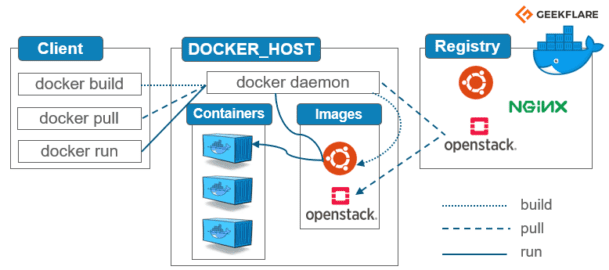

# Documentación de Docker

## Índice

1. [¿Qué es Docker?](#id1)
2. [Comandos de imágenes](#id2)
3. [Comandos de contenedores](#id3)
4. [Conectandose a los contenedores](#id4)
5. [Docker Compose](#id5)
6. [Volumenes](#id6)
7. [Ambientes y hot reload](#id7)


<div id='id1' />

## ¿Qué es Docker? ¿Cómo funciona?

Docker es una plataforma de software que le permite crear, probar e implementar aplicaciones rápidamente. Esto gracias al uso de lo que se denomina contenedores.

Un **contenedor** de Docker es un entorno ejecutable, independiente del sistema operativo, ligero que integra todo lo necesario para ejecutar una aplicación, incluidas bibliotecas, herramientas del sistema, código y tiempo de ejecución. Son portables, lo que permite compartirlo entre desarrolladores. Estos estan contenidos dentro de repositorios de contenedores, los cuales pueden ser privados o públicos, siendo de este último el más destacado [Docker Hub](https://hub.docker.com/).

De manera resumida, Docker nos permite que todo un equipo de desarrolladores dispongan de un mismo entorno de desarrollo, teniedo los mismos programas con la misma versión y evitando el tedioso proceso de reinstalar todo en cada ordenador de manera individualizada. Con un solo toque se puede tener una aplicación funcionando.



<div id='id2' />

## Comandos de imágenes

### Ver imagenes descargadas

```
docker images
```

### Descargar una imagen

Última versión

```
docker pull "nombre"
```

Una versión en concreto.

```
docker pull "nombre":"tag"
```

Puede darse el caso de que se produzca un error en los Mac con chip de Apple. Para solucioar este problema solo debemos indicar la plataforma en la que nos encontramos.

En el caso del chip M1:

```
docker pull --platform linux/x86_64 "nombre"
```

### Elimnar una imagen

```
docker image rm "nombre"
```

Si hay más de una de un mismo repositorio

```
docker image rm "nombre":"tag"
```

<div id='id3' />

## Comandos de contenedores

### Creación de un contenedor

Partiendo de una imagen descargada previamente.

```
docker create "nombre_imagen"
```

Podemos asigarle un nombre propio

```
docker create --name "nombre_cotenedor" "nombre_imagen"
```

### Creación de un contenedor con un puerto asignado

```
docker create -p"puerto_anfitrion":"puerto_docker" --name "nombre_contenedor" "nombre_imagen"
```

Es posible dejar que docker decida el puerto anfitrión de manera automática del siguiente modo.

```
docker create -p"puerto_docker" --name "nombre_contenedor" "nombre_imagen"
```

### Ejecutar un cotenedor

```
docker start "container id"
```

### Lista de contenedores en ejecución

```
docker ps
```

### Detener un contenedor

```
docker stop "container id"
```

### Lista de contenedores existentes (Parados o e ejecución)

```
docker ps -a
```

### Ver los logs de un contenedor

```
docker logs "nombre_cotenedor"
```

Podemos dejar que se actualice automaticamente la lista al haber cambios del siguiente modo.

```
docker logs --follow "nombre_cotenedor"
```

### Docker run

Este se trata de un comando que unifica docker pull, docker create y docker start. Su proceso de actuación es el siguiente:

1. Buscar a imagen y la descarga en caso de no tenerla ya
2. Crea el cotenedor con dicha imagen
3. Lo inicia

```
docker run "nombre_imagen"
```

Al ejecutarlo se nos mostrara a continuación los log, de tal modo que si pulsamos ctrl + c se detienen el cotenedor. Para evitar esto debemos agregar el parámetro -d

```
docker run -d "nombre_imagen"
```

En docker run también existe la posibilidad de cambiar el nombre del contenedor y asignar puertos.

```
docker run --name "nombre_contenedor" -p"puerto_anfitrion":"puerto_docker" -d "nombre_imagen"
```

Recordar que cada vez que se ejecuta `docker run` se crea un nuevo contenedor.

<div id='id4' />

## Conectandose a los contenedores

A la hora de conectar dos contenedores entre si es necesario crear una red conjunta, pues de otro modo aunque desde el sistema anfitrión los contenedores son visibles, entre ellos no lo son.

La manera en la que los contenedores se identifican dentro de la red es mediante el nombre del contenedor correspondiente. Por lo tanto, en vez de localhost o algún tipo de ip, utilizariamos dicho nombre identificativo.

## Listado de redes de docker

```
docker network ls
```

### ¿Cómo crear una red?

```
docker network create "nombre_red"
```

### ¿Cómo borrar una red?

```
docker network rm "nombre_red"
```

### Forma de construir una imagen

Para construir una imagen que contenga una aplicación, debemos crear un archivo dockerfile el cual determine las caractersticas de esta.

``` dockerfile
FROM node:18

RUN mkdir -p /home/app

# COPY "Ruta a copiar anfitrión" "Ruta destino dentro del cotenedor"
COPY . /home/app

EXPOSE 3000

# Es necesario poner una ruta absoluta

CMD ["node", "/home/app/index.js"]
```

Una vez tengamos el dockerfile, solo debemos ingresar el siguiente comando.

```
docker build -t "nombre_imagen":"tag" "ruta_dockerfile"
```

En ruta_dockerfile normalmente es la propia ubicación donde nos encontramos. Podemos indicar esto ingresando un único punto "."


<div id='id5' />

## Docker Compose

Hasta ahora para dockerizar hemos tenido que seguir los siguietes pasos por cada cotenedor:

1. Descargar la imagen
2. Crear una red
3. Crear un cotenedor
    1. Asignar puerto
    2. Asignar nombre
    3. Asigar variable de etorno
    4. Especificar red
    5. Idicar Imagen : etiqueta

Todo esto se puede automatizar con Docker Compose. Para esto, en la carpeta del proyecto en cuestión debemos crear el archivo `docker-compose.yml`

A continuación podemos ver un ejemplo de la estructura que debe tener este archivo:

``` yaml
version: "3.9"
services:
    chanchito:
        build: .
        ports:
            - "3000:3000"
        links:
            - monguito
    moguito:
        image: mongo
        ports:
            - "27017:27017"
        environment:
            MONGO_INITDB_ROOT_USERNAME=nico
            MONGO_INITDB_ROOT_PASSWORD=password
```

Como podemos observar, no es encesario crear ni asignar una red, pues esta operación la realizara de manera automatica Docker Compose. Para ejecutar el docker compose en un proyecto debemos ingresar el siguiente comando:

```
docker compose up
```

Para detenerlo pulsamos la convinación de teclas `ctrl + C`

Si quisieramos elminar todos los contenedores e imagenes creados por este Docker Compose, ingresariamos lo siguiente:

```
docker compose down
```

<div id='id6' />

## Volumenes

Un volumen de contenedor permite conservar los datos, aunque se elimine el Docker container. Los volúmenes también permiten un intercambio práctico de datos entre el host y el container.

Existen tres tipos de volumenes en Docker:

- **Anónimo: Solo se indica la ruta**  
    Se le indica a docker la dirección que queremos montar y el mismo decidira donde crear el volumen. Tiene la desventaja de que luego no podemos volver a referenciar el volumen para utilizarlo en otro contenedor.

- **De anfitrión o host**  
    En este caso tu decides que carpeta montar y donde montarla con total libertad.

- **Nombrado**  
    Funciona del mismo modo que el volumen anónimo, con la diferencia de que posteriormente se puede volver a referenciar el volumen para utilizarlo en la construcción de nuevos contenedores.

Para trabajar utilizando volumenes desde Docker Compose, debemos agregar lo siguiente:

```yaml
version: "3.9"
services:
    chanchito:
        build: .
        ports:
            - "3000:3000"
        links:
            - monguito
    moguito:
        image: mongo
        ports:
            - "27017:27017"
        environment:
            MONGO_INITDB_ROOT_USERNAME=nico
            MONGO_INITDB_ROOT_PASSWORD=password
        volumes:
            - mongo-data:/data/db
            # mysql -> /var/lib/mysql
            # postgres -> /var/lib/postgresql/data
            # Aquí debemos indicar la ruta dentro del contenedor donde se guardan los archivos       

#Indicamos el nombre de todos los contenedores que vamos a utilizar
volumes:
    mongo-data:
```

De este modo, conseguiremos que nuestros archivos sean persistentes y no se borren a la hora de borrar o recrear un contenedor.

<div id='id7' />

## Ambientes y hot reload

En caso de que necesitemos tener dos ambientes diferentes uno para desarrollo y otro para producción podemos crear dos Dockerfile. 

A continuación, podemos ver un ejemplo de como sería este nuevo Dockerfile, el cual en este caso pasaría a llamarse `Dockerfile.dev`. En este caso, preparariamos un ambiente donde disponemos de **nodemon** para poder hacer uso del **hot reload** y así evitar tener que reiniciar la aplicación para visualizar cualquier cambios que hagamos en el código.

``` dockerfile
FROM node:18

RUN npm i -g nodemon
RUN mkdir -p /home/app

# Direcctorio de trabajo para poder usar rutas relativas en CMD
WORKDIR /home/app

EXPOSE 3000

CMD ["nodemon", "index.js"]
```

Al igual que existe un Dockerfile, también se puede crear un docker compose de desarrollo. El nombre del archivo sería `docker-compose-dev.yml`

```yaml
version: "3.9"
services:
    chanchito:
        build:
            context: .
            dockerfile: Dockerfile.dev
        ports:
            - "3000:3000"
        links:
            - monguito
        volumes:
            - .:/home/app   # Volumen anónimo
    moguito:
        image: mongo
        ports:
            - "27017:27017"
        environment:
            MONGO_INITDB_ROOT_USERNAME=nico
            MONGO_INITDB_ROOT_PASSWORD=password
        volumes:
            - mongo-data:/data/db

volumes:
    mongo-data:
```

Para hacer uso de un docker compose personalizado se debe agregar el siguiente parametro a los comandos:

```
docker compose -f docker-compose-dev.yml up
```

```
docker compose -f docker-compose-dev.yml down
```
De este modo le estamos indicando que queremos hacer uso de un archivo personalizado.