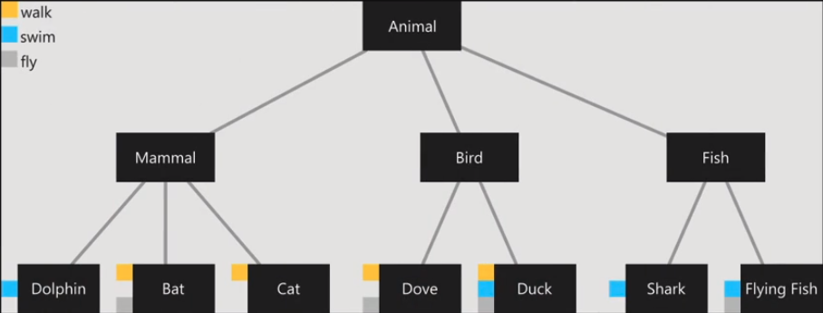

# Lenguaje Dart

## Índice

1. [¿Qué es Dart?](#id1)
2. [Factory constructors](#id2)
3. [Enums](#id3)
4. [Herencia](#id4)
5. [Clases abstractas](#id5)
6. [Mixins](#id6)
7. [try catch](#id7)
8. [Datos genéricos](#id8)
9. [Futures](#id9)
10. [Lambda functions](#id10)
11. [Faker](#id11)
12. [Timeago](#id12)


<div id='id1' />

## ¿Qué es Dart?
Dart es un lenguaje de programación de código abierto, desarrollado por Google. Fue revelado en la conferencia goto; en Aarhus, Dinamarca el 10 de octubre de 2011.


<div id='id2' />

## Factory constructors

El **constructor factory** es un constructor especial que nos permite crear instancias especiales de una clase.

``` dart
void main(List<String> arguments) {
  final lulu = Pet(
    age: 5,
    name: 'LULU',
  );

  final luna = Pet.fromBirthday(
    name: 'LUNA',
    birthdayAsString: '2021-05-18',
  );

  final oso = Pet.fromName('OSO');

  //Imprimimos por consola las dos mascotas
  print(lulu);
  print(luna);
  print(oso);
}


class Pet {
  String name;
  late int age;

  //Constructor
  Pet({
    required this.name,
    required this.age,
  });

  //Factory a partir de un nombre y fecha de nacimiento
  factory Pet.fromBirthday({
    required String name,
    required String birthdayAsString,
  }) {
    final birthday = DateTime.parse(birthdayAsString);
    final currentDate = DateTime.now();

    final days = currentDate.difference(birthday).inDays;
    final age = (days / 365).round();

    return Pet(
      name: name,
      age: age,
    );
  }

  //Factory que funciona a partir de unicamente un nombre
  factory Pet.fromName(String name) {
    return Pet(
      name: name,
      age: 0,
    );
  }

  @override
  String toString() {
    return "name: $name, age: $age";
  }
}

```


<div id='id3' />

## Enums

Clase que contiene un número determinado de valores que son constantes, que podríamos asociar con las fases por las que puede pasar un objeto.

``` dart
void main(List<String> arguments) {
  print(Status.values);

  final orderStatus = Status.created;

  switch (orderStatus) {
    case Status.created:
      break;
    case Status.onTheWay:
      break;
    case Status.ready:
      break;
    case Status.delivered:
      break;
  }
}

enum Status {
  created,
  onTheWay,
  ready,
  delivered,
}

/*
class Status {
  static const int created = 0;
  static const int ready = 1;
  static const int onTheWay = 2;
  static const int delivered = 3;
}
*/
```


<div id='id4' />

## Herencia

El objetivo de la herencia es el permitirnos reutilizar, ampliar y/o cambiar el comportamiento de una clase existente, llamada superclase, en nuevas clases, llamadas clase derivadas o hijas. En Dart, podemos heredar de una única clase, pero la herencia es transitiva.

``` dart
class Pet {
  final String name;
  final int age;

  //Constructor
  const Pet({
    required this.name,
    required this.age,
  });

  @override
  String toString(){
    return "name: $name, age: $age";
  }
}


class Dog extends Pet {
  final int legs;

  Dog({
    required String name,
    required int age,
    required this.legs,
  }) : super(
          name: name,
          age: age,
        );

  void run() {
    print("running");
  }

  void jump() {
    print("jumpping");
  }

  @override
  String toString(){
    return "${super.toString()}, legs: $legs";
  }
}


class Fish extends Pet {
  final int fins;

  Fish({
    required String name,
    required int age,
    required this.fins,
  }) : super(
          name: name,
          age: age,
        );

  void swim() {
    print("swimming");
  }
}
```


<div id='id5' />

## Clases abstractas

Una clase abstracta es una clase que no se puede instanciar. En ellas se deja sin implementar algunos miembros o todos ellos para que las clases derivadas puedan proporcionar las implementaciones.


En el siguiente ejemplo, la clase **Pet** al ser abstracta no se podría instanciar. En cambio, la clase **Dog** sí sería posible instanciarla, estando esta heredada de la primera.

``` dart
abstract class Pet {
  final String name;
  final int age;

  //Constructor
  const Pet({
    required this.name,
    required this.age,
  });

  @override
  String toString() {
    return "name: $name, age: $age";
  }

  void sleep();

  void awake();
}


class Dog extends Pet {
  final int legs;

  const Dog({
    required String name,
    required int age,
    required this.legs,
  }) : super(
          name: name,
          age: age,
        );

  void run() {
    print("running");
  }

  void jump() {
    print("jumpping");
  }

  @override
  String toString() {
    return "${super.toString()}, legs: $legs";
  }
  
  @override
  void awake() {
    // TODO: implement awake
  }
  
  @override
  void sleep() {
    print("sleep dop");
  }
}


class Fish extends Pet {
  final int fins;

  const Fish({
    required String name,
    required int age,
    required this.fins,
  }) : super(
          name: name,
          age: age,
        );

  void swim() {
    print("swimming");
  }
  
  @override
  void awake() {
    // TODO: implement awake
  }
  
  @override
  void sleep() {
    print("sleep fish");
  }
}
```


### **Main**

``` dart
void main(List<String> arguments) {

  const lazy = Dog(
    name: 'Lazy',
    age: 10,
    legs: 4,
  );

  const dory = Fish(
    name: 'Dory',
    age: 1,
    fins: 3,
  );

  lazy.sleep();
  dory.sleep();
}
```


<div id='id6' />

## Mixins

un mixin es una forma de reutilizar código en múltiples clases sin utilizar herencia tradicional. Un mixin permite agregar funcionalidad adicional a una clase sin necesidad de ser su superclase. Es comparable a las interfaces en Java.

A continuación podemos ver un ejemplo de como funcionan:



### **Modelos**

``` dart
abstract class Animal {}

abstract class Fish extends Animal {}

abstract class Bird extends Animal {}

abstract class Mammal extends Animal {}


class Dolphin extends Mammal with SwimMixin {}
class Bat extends Mammal with WalkMixin, FlyMixin {}
class Cat extends Mammal with WalkMixin {}

class Dove extends Bird with WalkMixin, FlyMixin {}
class Duck extends Bird with SwimMixin, WalkMixin, FlyMixin {}

class Shark extends Fish with SwimMixin {}
class FlyingFish extends Fish with FlyMixin, SwimMixin {}


mixin WalkMixin on Animal {
  void walk(){
    print('$runtimeType walking');
  }
}

mixin SwimMixin on Animal {
  void swim(){
    print('$runtimeType swimming');
  }
}

mixin FlyMixin on Animal {
  void fly(){
    print('$runtimeType flying');
  }
}
```


### **Main**

``` dart
void main(List<String> arguments) {

  final dolphin = Dolphin();
  final duck = Duck();
  final shark = Shark();
  final bat = Bat();
  final cat = Cat();
  final dove = Dove();
  final flyingFish = FlyingFish();

  dolphin.swim();
  duck.swim();
  duck.walk();
  duck.fly();
  shark.swim();
  bat.walk();
  bat.fly();
  cat.walk();
  dove.walk();
  dove.fly();
  flyingFish.swim();
  flyingFish.fly();
}
```


<div id='id7' />

## Try catch

La construcción try... catch permite manejar errores de tiempo de ejecución. Literalmente permite “intentar (try)” ejecutar el código y “atrapar (catch)” errores que pueden ocurrir en él.

``` dart
void main(List<String> arguments) {
  print(calculateAge());
}

double? calculateAge() {
  try {
    print("Enter a birthday:");
    final text = stdin.readLineSync();
    if (text != null) {
      final birthday = DateTime.parse(text);
      final currentDate = DateTime.now();

      // Error provocado de prueba
      final numbers = <int>[];
      print(numbers[2]);

      final days = currentDate.difference(birthday).inDays;
      final age = days / 365;

      return age;
    }
  } on FormatException catch (e, s) {
    print(e.message);
    print(s);
  } catch (e, s) {
    if (e is! RangeError){
      print("e is not a RangeError");
    }
  } finally {
    print("🔥");
  }

  return null;
}
```

### Finally

Este bloque de código se ejecuta siempre al terminar el Try-catch. Tanto si hubo ausencia de error como si se produjo.


<div id='id8' />

## Datos genéricos

Los genéricos en Dart permiten a los desarrolladores crear componentes flexibles y reutilizables mientras preservan la seguridad de tipos. Son una forma de crear «tipos parametrizados», lo que significa que puede crear una sola clase, función o método que funcione con diferentes tipos de datos.

### **Tuple**

``` dart
class Tuple<A, B> {
  final A left;
  final B right;

  Tuple(this.left, this.right);
}
```


### Main

``` dart
void main(List<String> arguments) {
  final loginResult = login("test@test.com", "test");

  if (loginResult.left == 200) {
    print("TOKEN ${loginResult.right}");
  } else if (loginResult.left == 404) {
    print("user not found");
  } else {
    print("access denied");
  }
}

Tuple<int, String?> login(String email, String password) {
  if (email == "test@test.com" && password == "test") {
    final token = "MY_TOKEN";
    return Tuple(200, token);
  } else if (email != "test@test.com") {
    return Tuple(404, null);
  }
  return Tuple(403, null);
}
```


<div id='id9' />

## Futures

Un future permite la programación asincrónica en Dart. Con la programación asincrónica, se permite que la aplicación realice otras operaciones mientras se completa la operación asincrónica.

### **Ejemplo 1:**

``` dart
void main(List<String> arguments) {
  print("hola");

  sleep(5).then(
    (value) {
      print(value);
      print("🐶");
    },
  );
}

Future<String> sleep(int seconds) {
  return Future.delayed(
    Duration(seconds: seconds),
    () {
      return "jeje";
    },
  );
}
```

### **Ejemplo 2:**

``` dart
import 'dart:async';

void main(List<String> arguments) async {
  print("hola");
  await sleep(2);
  print("🎃");
}

Future<void> sleep(int seconds) {
  return Future.delayed(
    Duration(seconds: seconds),
  );
}
```

### **Ejemplo 3:**

``` dart
import 'dart:async';

void main(List<String> arguments) async {
  try {
    print("hola");
    await sleep(3000);
    // print(message);
    print("🎃");
  } catch (e) {
    print(e);
  }
}

Future<String> sleep(int milliseconds) {
  Completer<String> completer = Completer();

  Timer(
    Duration(milliseconds: milliseconds),
    () {
      // throw RangeError('custom error');
      completer.completeError(
        RangeError('custom error'),
      );
      // completer.complete("🥶");
    },
  );

  return completer.future;
}

```


<div id='id10' />

## Lambda funtions

Una función lambda se define donde se usa, de esta manera no hay una función extra utilizando espacio en memoria. Si una función es utilizada una sola vez, lo mejor es usar una función lambda para evitar código innecesario y desorganizado.

``` dart
import 'dart:async';

void main(List<String> arguments) async {
  try {
    print("hola");
    await sleep(3000);
    // print(message);
    print("🎃");
  } catch (e) {
    print(e);
  }
}

Future<String> sleep(int milliseconds) {
  Completer<String> completer = Completer();

  Timer(
    Duration(milliseconds: milliseconds),
    () => completer.complete("🥶"),   // Lambda funtions
  );

  return completer.future;
}
```


<div id='id11' />

## Faker
Dependencia: `faker: ^2.0.0`

Se trata de una dependencia que genera datos falsos y aleatorios. A continuación podemos ver algunos ejemplos:

``` dart
import 'package:faker/faker.dart';

main() {
  var faker = new Faker();

  // Correo electrónico aleatorio
  faker.internet.email();

  // Dirección ipv6 aleatoria
  faker.internet.ipv6Address();

  // Nombre de usuario de internet aleatorio
  faker.internet.userName();

  // Nombre
  faker.person.name();

  //Mrs.
  faker.person.prefix();

  //Sr.
  faker.person.suffix();
  
  // Frase
  faker.lorem.sentence();

  // Localización
  faker.geo.longitude();
  faker.geo.latitude();

  // URL de imagen aleatoria
  faker.image.image();

  //Fecha aleatoria
  faker.date.dateTime();

  //Números enteros
  faker.randomGenerator.integer(50000);
}
```

Estos son algunos de los tipos de datos que se pueden generar con esta librería. Como podemos ver, es muy fácil de usar y muy versátil. Para más información podemos consultar la siguiente página.

[https://pub.dev/packages/faker](https://pub.dev/packages/faker)


<div id='id12' />

## Timeago

Dependencia: `timeago: ^3.6.0`

Se trata de una dependencia que convierte una fecha en un texto compresible para el usuario. En lugar de mostrar una fecha con el formato 2024-12-12 18:30 esta dependencia puede mostrarla algo como “now”, “an hour ago”, etc.

A contaminación podemos ver un ejemplo de como se usa.

``` dart
import 'package:timeago/timeago.dart' as timeago;

main() {
    final fifteenAgo = DateTime.now().subtract(Duration(minutes: 15));

    print(timeago.format(fifteenAgo)); // 15 minutes ago
    print(timeago.format(fifteenAgo, locale: 'en_short')); // 15m
    print(timeago.format(fifteenAgo, locale: 'es')); // hace 15 minutos
}
```

Para más dudas consultar la siguiente página de la documentación oficial.

[https://pub.dev/packages/timeago](https://pub.dev/packages/timeago)

