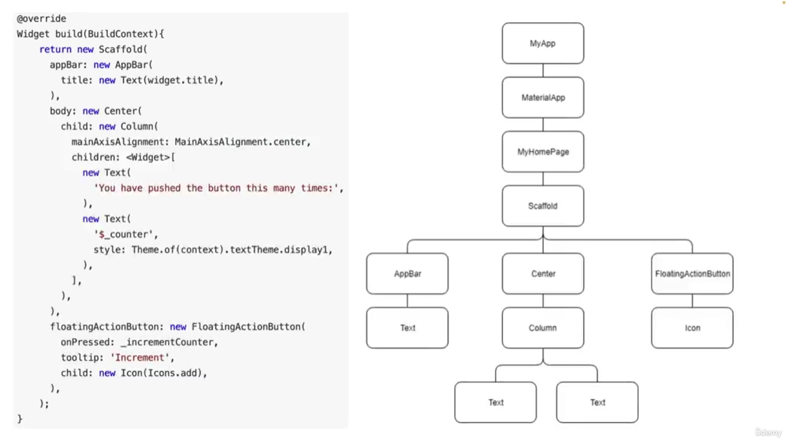
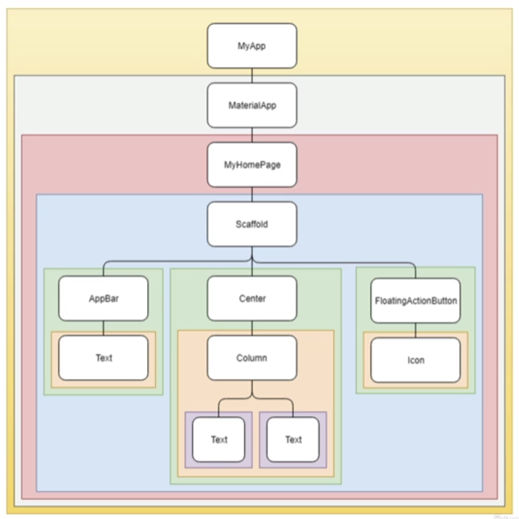

# StatelessWidget y StatefulWidget

## Índice

1. [El árbol de widgets](#id1)
2. [Contexto](#id2)
    1. [¿Para que sirve el contexto?](#id21)
3. [Stateless Widget](#id3)
    1. [¿Puedo cambiar sus propiedades durante el tiempo de ejecución?](#id31)
4. [Stateful Widget](#id4)


<div id='id1' />

## El árbol de widgets

En Flutter, los widgets se organizan como si de un árbol se tratara. Los widget pueden tener un widget padre y widgets hijos.




<div id='id2' />

## Contexto

En Flutter todo widget tiene un contexto. Como te habras fijado, siempre que creamos un widget en el método build disponemos de un parámetro llamado **BuildContext**. Este sería el contexto en el que se encuentra nuestro widget.



<div id='id21' />

### ¿Para que sirve el contexto?

En Flutter necesitamos el contexto para:
- Saber en que parte del árbol se encuentra el widget.
- Saber las dimensiones de un widget.
- Conocer si un widget se muestra por pantalla o no.
- Saber si un widget ya fue eliminado de memoria.
- Acceder a un dato que se encuentra dentro de un widget padre desde un widget hijo.


<div id='id3' />

## Stateless Widget

Son aquellos que dependen unicamente de los datos pasados a la hora de su creación. Un ejemplo de este tipo puede ser los widget Text, Row, Column y Container.

```dart
class MyStatelessWidget extends StatelessWidget {
    MyStatelessWidget({
        Key key,
        this.parameter,
    }): super (key:key);

    final parameter;

    @override
    Widget build(BuildContext context){
        return new ...
    }
}
```

<div id='id31' />

### ¿Puedo cambiar sus propiedades durante el tiempo de ejecución?

Una de las caracteristicas que debe tener un Stateless Widget es que todas sus propiedades deben estar marcadas como **final**, debido a que estas no cambiaran durante el tiempo de ejecución.

Sin embargo, esto no implica que no sea posible modificar un dato durante el tiempo de ejecución. Una manera con la que se puede realizar esta acción es eliminar el widget y volverlo a crear con el nuevo dato. Lógicamente, esta acción supone un mayor consumo de recursos respecto al uso de un **StatefulWidget**.


<div id='id4' />

## Stateful Widget

A diferencia de los StatelessWidget, estos sí disponen de un estado propio, el cual puede cambiar durante el tiempo de ejcución. 

Tienen su propio ciclo de vida, de tal modo que podemos saber cuando el widget será incertado en el árbol de widget, cuando ya está visible en pantalla y cuando va a ser destruido. Ejemplo de este tipo de widgets pueden ser los Checkboxes y Button.


```dart
// Esta clase define el Widget en si
class MyStatefulWidget extends StatefulWidget {

  MyStatefulWidget({
      Key key,
      this.parameter,
  }): super(key: key);

  final parameter;

  @override
  _MyStatefulWidgetState createState() => new _MyStatefulWidgetState();
}

// Esta clase guarda el estado del widget definido. En ella se gestiona su ciclo de vida
class _MyStatefulWidgetState extends State<MyStatefulWidget> {

  // Solo se ejecuta una vez
  // Cuando es creado el State y este es incertado en el árbol de widgets
  @override
  void initState(){
      super.initState();
  }

  // Método llamado una vez ya este incertado el widget. También es llamado cuando alguna dependencia ha cambiado
  @override
  void didChangeDependencies() {
      super.didChangeDependencies();
  }

  // Método llamado cuando nuestro widget ya no está visible en pantalla y va a ser eliminado. En el se liberal los recursos que se están utilizando.
  @override
  void dispose() {
      super.dispose();
  }

  // Método encargado de recosntruir la vista. Es llamado por cada actualización
  @override
  Widget build(BuildContext context) {
      return new ...
  }
}
```

### Ejemplo 1

En este ejemplo podemos observar una vista simple con un botón y un número el cual comienza en 100 y va aumentando según se pulse el botón, de tal modo que sa reconstruye la vista cada vez que hace falta.

#### Main
``` dart
void main() {
  runApp(const MyApp());
}

class MyApp extends StatelessWidget {
  const MyApp({super.key});

  @override
  Widget build(BuildContext context) {
    return MaterialApp(
      title: 'Flutter Demo',
      theme: ThemeData(
        colorScheme: ColorScheme.fromSeed(seedColor: Colors.deepPurple),
        useMaterial3: true,
      ),
      home: const CounterPage(
        initialValue: 100,
      ),
    );
  }
}

```

#### CounterPage

``` dart
class CounterPage extends StatefulWidget {
  final int initialValue;

  const CounterPage({
    super.key,
    this.initialValue = 0,
  });

  @override
  State<CounterPage> createState() {
    return _CounterPageState();
  }
}


class _CounterPageState extends State<CounterPage> {
  late int counter;

  // Solo se ejecuta una vez
  // Cuando es creado el State y este es incertado en el árbol de widgets
  @override
  void initState() {
    super.initState();
    counter = widget.initialValue;
  }

  // Es llamado cada vez que se reconstruye la vista
  @override
  Widget build(BuildContext context) {
    print('🔥');
    return Scaffold(
      appBar: AppBar(),
      body: Center(
        child: Text(
          '$counter',
          style: const TextStyle(fontSize: 40),
        ),
      ),
      floatingActionButton: FloatingActionButton(
        onPressed: () {
          counter++;
          setState(() {});
          // Se vuelve a reconstruir la vista llamando a build
        },
      ),
    );
  }
}

```

<div style="text-align: center;">
    
</div>


### Ejemplo 2

Este ejemplo es parecido al 1, con la diferecia de que el cotador va aumentando él solo cada vez que pasa 1 segundo. Al pulsar el botón se oculta dicho contador y el StatefulWidget se destruye al no estar visible. 

Aquí podemos ver la importacia del dispose(), pues en él tenemos que cancelar la operación de la función encargada del tiempo transcurrido. En caso de no cancelarla se produce una excepcion al no existir el widget donde debe actuar.

#### Main

``` dart
import 'package:flutter/material.dart';
import 'package:stateful_and_stateless/pages/timer/timer_page.dart';

void main() {
  runApp(const MyApp());
}

class MyApp extends StatelessWidget {
  const MyApp({super.key});

  @override
  Widget build(BuildContext context) {
    return MaterialApp(
      title: 'Flutter Demo',
      theme: ThemeData(
        colorScheme: ColorScheme.fromSeed(seedColor: Colors.deepPurple),
        useMaterial3: true,
      ),
      home: const HomePage(),
    );
  }
}
```

#### TimerPage

``` dart
import 'package:flutter/material.dart';
import 'dart:async';

// Widget correspodiete a la estructura de la pantalla

class HomePage extends StatefulWidget {
  const HomePage({super.key});

  @override
  State<HomePage> createState() => _HomePageState();
}

class _HomePageState extends State<HomePage> {
  bool _showTimer = true;

  @override
  Widget build(BuildContext context) {
    return Scaffold(
      body: SafeArea(
        child: Column(
          children: [
            if (_showTimer) const TimerView(),
          ],
        ),
      ),
      floatingActionButton: FloatingActionButton(
        onPressed: () {
          _showTimer = !_showTimer;
          setState(() {});
        },
      ),
    );
  }
}

// Widget correspodiete al contador

class TimerView extends StatefulWidget {
  const TimerView({super.key});

  @override
  State<TimerView> createState() => _TimerPageState();
}

class _TimerPageState extends State<TimerView> {
  int _time = 0;
  Timer? _timer;

  @override
  void initState() {
    super.initState();
    print("🔥");
    _timer = Timer.periodic(
      const Duration(seconds: 1),
      (_) {
        _time++;
        setState(() {});
      },
    );
  }

  @override
  void dispose() {
    print("timer dispose");
    _timer?.cancel();
    super.dispose();
  }

  @override
  Widget build(BuildContext context) {
    return Text(
      '$_time',
      style: const TextStyle(fontSize: 50),
    );
  }
}
```
