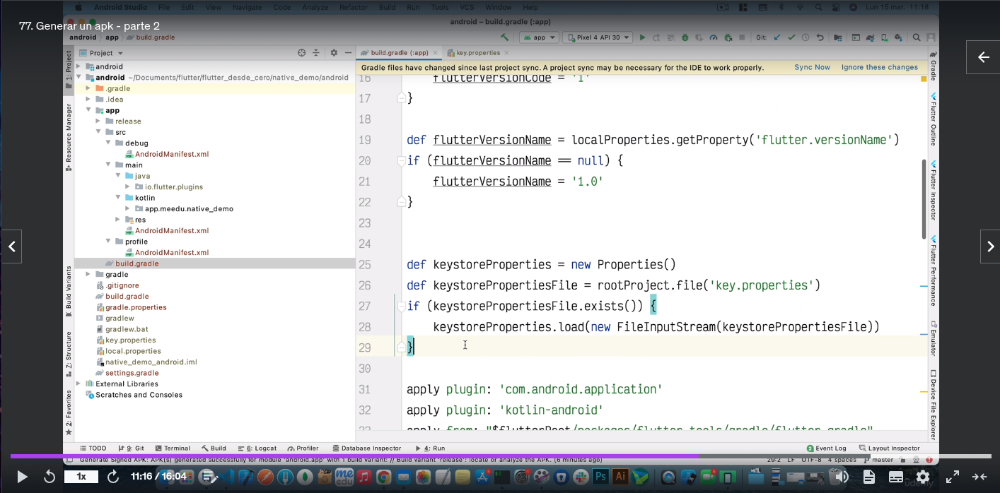
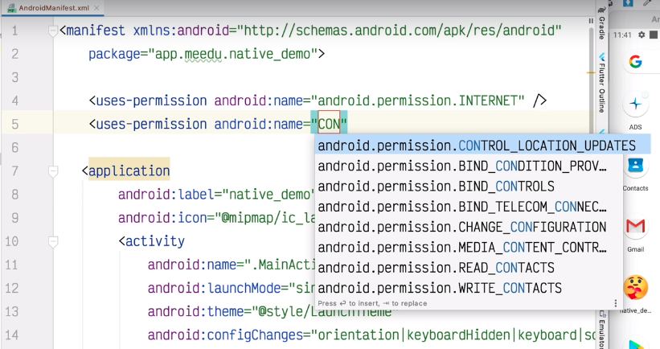
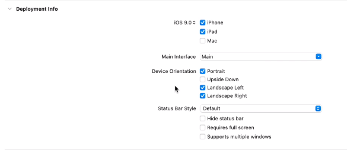
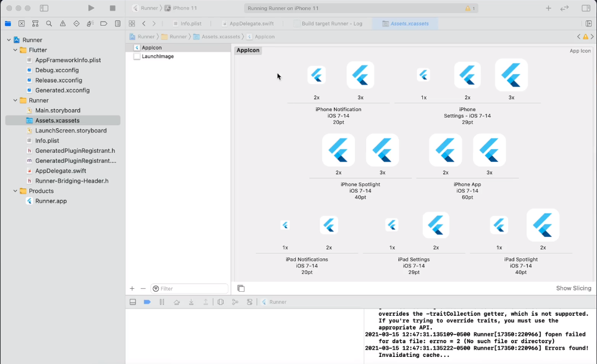
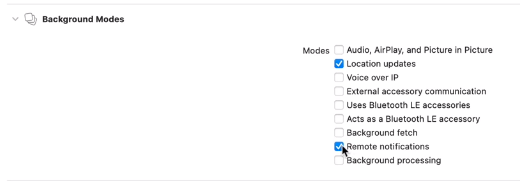
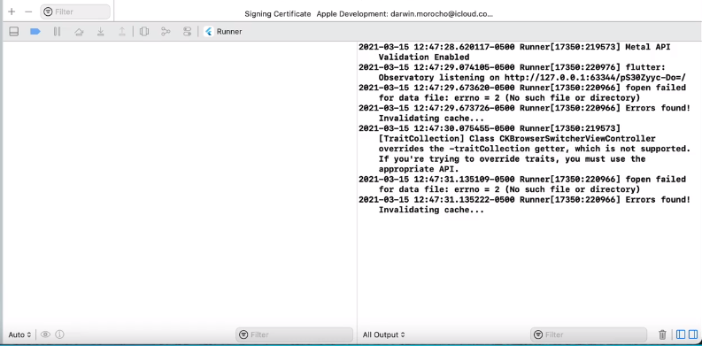
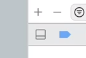

# Conceptos básicos sobre Flutter
### **Índice**
1. [Creación de proyectos Flutter](#id1)
	1. [Terminal](#id11)
	2. [Visual Studio Code](#id12)
	3. [Android Studio](#id13)
2. [Simuladores y emuladores](#id2)
3. [Generación de un APK](#id3)
	1. [Generar un apk por linea de comandos](#id31)
4. [AndroidManifest.xml](#id4)
5. [Datos básicos sobre xCode](#id5)
	1. [¿Cómo abro un proyecto de Flutter en xCode?](#id51)
	2. [Cambiar el identificador de la aplicación, versión y build](#id52)
	3. [Cómo firmar la aplicación](#id53)
	4. [¿Cómo le cambio el nombre a mi aplicación?](#id54)
	5. [¿Cómo puedo agregar permisos a la aplicación?](#id55)
	6. [¿Cómo puedo definir una versión mínima de iOs y compatibilidad de dispositivos?](#id56)
	7. [Definir la orientación de la pantalla y habitar o desahabilitar Status Bar Style](#id57)
	8. [Cambiar el icono de la aplicación e imagen de inicio](#id58)
	9. [Las Capabilities](#id59)
	10. [¿Cómo puedo eliminar la cache de compilación?](#id510)
	11. [¿De qué modo puedo visualizar los log de la aplicación?](#id511)
	12. [¿Qué se debe tener en cuenta para subir una aplicación a la AppStore?](#id512)

<div id='id1' />

## Creación de proyectos Flutter

<div id='id11' />

### Terminal
En el directorio deseado, mediante el terminal introducimos el siguiente comando:

``` bash
flutter create "nombre proyecto"
```

Hay que tener en cuenta que este comando crea un proyecto cuyo package por defecto es com.example. Lo que podría darnos ciertos problemas de compatibilidad al instalar la aplicación en un dispositivo Android.

Para evitar este problema, podemos crear el proyecto indicándole mediante linea de comandos el nombre del paquete del siguiente modo.

``` bash
flutter create "nombre del paquete" "nombre proyecto"
```

Ejemplo:

``` bash
flutter create com.nimio hello_world
```

<div id='id12' />

### Visual Studio Code

En Visual Studio Code es tan sencillo como:
1. Abrir el dialogo de comandos (control + shift + p)
2. Introducir Flutter: New Project
3. Seleccionamos Aplication

Como podremos ver, el proyecto que se nos ha creado tiene por nombre de paquete com.example , podemos hacer que en vscode cuando se nos cree un proyecto nuevo tenga un nombre de package personalizado predeterminado del siguiente modo:

1. Nos dirigimos a `File > Preferences > Settings`
2. En la barra de búsqueda escribimos “flutter”
3. En el apartado Dart: Flutter Create Organization pulsamos en `Edit in settings.json`
4. Nos llevara a una linea del documento settings.json donde podremos cambiar el prefijo, para que sea el usado por cualquier proyecto flutter que vayamos a crear.

<div id='id13' />

### Android Studio

Esta sería la forma más fácil pues esta bastante bien automatizado y los pasos son fáciles. Tan solo será necesario buscar la opción New Flutter Project y seguir los pasos que se nos indique. ES importante tener cuidado con donde creamos el proyecto, pues de forma predeterminada no se crea una carpeta que lo contenga. Podemos indicar el nombre de la carpeta en la ruta del proyecto y Android Studio la creara de forma automática.

<div id='id2' />

## Simuladores y emuladores

En Android recibe el nombre de emulador y en IOS el nombre de simulador.

Hay que tener en cuenta que el simulador de IOS solo se puede ejecutar en un Mac que disponga de xCode. Una vez tengamos instalada su última versión, podemos ejecutar el emulador desde una termina introduciendo el siguiente comando:

``` bash 
open -a simulator
```

En Visual Studio Code podemos usar este emulador/simulador pulsando al combinación de teclas `control + shift + p` y en el cuadro de dialogo que se nos abra debemos buscar “Flutter: Select Device”. De este modo, se nos mostrara una lista con los dispositivos disponibles para lanzar nuestra aplicación.
Otra maera psible sería con una opción localizada en la parte inferior derecha del IDE, donde también dispondremos de una lista.

Es posible también lanzar la aplicación flutter desde linea de comandos empleado el siguiente comando (es importante tener ya un emulador en ejecución o un dispositivo físico conectado):

``` bash 
flutter run
```
En el terminal se nos mostrara como interactuar con el emulador:

``` bash
Flutter run key commands.
r Hot reload. 🔥🔥🔥
R Hot restart.
h List all available interactive commands.
d Detach (terminate "flutter run" but leave application running).
c Clear the screen
q Quit (terminate the application on the device).
```

<div id='id3' />

## Generación de un APK

<div id='id31' />

### Generar un apk por linea de comandos

``` bash
flutter build apk
```

Esta apk generada será de tipo Release, mucho más liviana que una apk de debug. Posiblemente se guarde en la siguiente dirección:

```
build/app/outputs/flutter-apk/app-release.apk
```

Es importante tener en cuenta que tanto este apk como el que se generaría mediante Android Studio disponen de una firma por defecto de debug, aun siendo una apk de release, por lo que no se podría subir a la Play Store. Es necesario que dispongamos de nuestra propia firma.

**Podemos generar una firma de dos formas:**

- Mediante línea de comandos con el siguiente comando

``` bash
keytool -genkey -v -keystore ~/key.jks -keyalg RSA -keysize 2048 -validity 10000 -alias “nombre_key”
```

- Mediante la herramienta proporcionada por Android Studio

En Android Studio sería tan fácil como dirigirnos a `Build > Generate Signed Bundle / APK…` y seguir los pasos que se nos indique.

Una vez ya dispongamos de nuestra firma, ya podremos hacer uso de ella para compilar nuestro apk. Para ello, debemos crear el siguiente archivo con nombre “key.properties” dentro de la carpeta de app de nuestro proyecto. Dicho archivo dentra el siguiente contenido:

```
storePassword=<password from previous step>
keyPassword=<password  from previous step>
keyAlias=<alias key>
storeFile=<location of the key store file, such as /Users/<user name>/key.jks>
```

A continuación nos dirigimos a `app > build.gradle` y agregamos por encima de los apply plugin el siguiente código.

``` gradle
def keystoreProperties = new Properties()
def keystorePropertiesFIle = rootProject.file(‘key.properties’)
if (keystorePropertiesFile.exists()) {
	keystoreProperties.load(new FileInputStream(keystorePropertiesFile))
}
```



En el mismo archivo, por encima de buildTypes debemos agregar (sin cambiar nada) el siguiente código:

``` gradle
SigningConfigs {
	release {
		keyAlias keystoreProperties[‘keyAlias’]
		keyPassword keystoreProperties[‘keyPassword’]
		storeFile keystoreProperties[‘storeFile’] ? file(keystoreProperties[‘storeFile’]) : null
		storePassword keystoreProperties[‘storePassword’]
	}
}
```

y modificamos el contenido de buildTypes:

``` gradle
buildTypes {
	release {
		signingConfig signingConfigs.release
	}
}
```

De este modo, a partir de ahora cuando compilemos el apk mediante el comando flutter build apk se utilizara nuestra firma y credenciales.

Si falla en el proceso, una posible solución puede ser asegurarse de que todos los archivos se han guardado y volver a ejecutar el comando.

En caso de que vayamos a compilar el apk desde la opción de interfaz de Android Studio `(Build > Build Bundle(s) / APK(s) > Build APK(s))`, podemos alternar entre una compilación de debug y una de release dirigiéndonos en el IDE al apartado de Build Variants, indicando desde aquí nuestra preferencia. 

|⚠️ Es posible que a la hora de debuguear (por ejemplo, por USB) está opción deba estar en debug.|
|---|

<div id='id4' />

## AndroidManifest.xml

Difernetes tipos de permisos:

- Permiso de internet
``` xml
<uses-permission android:name=”android.permission.INTERNET” />
```

- Permiso leer contactos
``` xml
<uses-permission android:name=”android.permission.READ_CONTACTS />
```

- Permiso memoria externa
``` xml
<uses-permission android:name=”android.permission.READ_EXTERNAL_STORAGE />
```



Dentro de la etiqueta `<aplication />` nos podremos encontrar una o varias etiquetas llamadas `<activity />`. En el caso de Flutter, a nivel nativo solo se usa la activity principal `android:name=”.MainActivity”`. Por ello, a nivel de Flutter debemos realizar una buena gestión de las Widget para disponer de un buen rendimiento.

Podemos saber que se trata de una activity principal porque contendrá la siguiente etiqueta.

``` xml
<intent-filter>
	<action android:name=”android.intent.action.MAIN” />
	<category android:name=”android.intent.category.LAUNCHER” />
</intent-filter>
```

---

**¿De que modo puedo cambiar el lenguaje por defecto nativo de mi aplicación de Kotlin a Java?**

Para llevar a cabo este procedimiento solo debemos eliminar el archivo MainActivity.kt y sustituirlo por un MainActivity.java , dentro del cual debemos agregar el siguiente código.

``` kotlin
Package com.nimio.app;

import io.flutter.embedding.android.FlutterActivity;

public class MainAcitvity extends FlutterActivity {

}
```

Seguramente, al intentar compilar la aplicación nos salte un error de archivos duplicados. Para solucionarlo, solo debemos eliminar la carpeta build desde la vista de proyecto Flutter. EL objetivo de está acción sería eliminar la cache para poder realizar una compilación limpia.

<div id='id5' />

## Datos básicos sobre xCode

<div id='id51' />

### ¿Cómo abro un proyecto de Flutter en xCode?
Para poder ejecutar un proyecto solo debemos abrir el archivos _Runner.xcworkspace_

<div id='id52' />

### Cambiar el identificador de la aplicación, versión y build
En la lista de directorios de xCode a la izquierda abrimos Runner. En el menú que se nos abre nos dirigimos a `General > Identity`

El Bundle Identifier debe ser único y registrado por Apple. En caso de no ser así tendremos problemas a la hora de firmar la aplicación.

<div id='id53' />

### Cómo firmar la aplicación
`Runner > Signing & Capabilities`

Para firmar nuestra aplicación, debemos seleccionar en el apartado Team una cuenta de desarrollador para disponer de un certificado. Hay que tener en cuenta que existen dos tipos de cuentas de desarrollador de Apple:

- **Cuenta gratuita**  
    Tiene ciertos limitantes. Por ejemplo, no puedes usar notificaciones push, algunos servicios en segundo planos, no se puede probar las características de Apple Pay entre otros problemas.
	Es necesario disponer de un dispositivo de Apple (iPhone o iPad) para activar 	la cuenta.
	Solo permite crear un único certificado de desarrollo  y solamente del tipo 	Apple Developmet.

- **Cuenta de pago** (sobre 100$ al año)  
    Nos permite acceder a todas las capacidades no presentes en la cuenta gratuita y subir nuestras aplicaciones a la AppStore.  
    Se dispone también de la capacidad de crear diferentes tipos de certificados. Entre ellos tendríamos disponible el certificado de Apple Distribution, el cual nos permite subir nuestra aplicación a la AppStore. También tendríamos disponible el certificado de Mac Installer Distribution.

Podemos gestionar nuestras cuenta de desarrollador desde [developer.apple.com](https://developer.apple.com/)

<div id='id54' />

### ¿Cómo le cambio el nombre a mi aplicación?
Existen dos formas de cambiar el nombre a nuestra aplicación

- **Mediante interfaz**  
Nos dirigimos a Runner > info.plist. Al abrir este archivo, xCode nos mostrara 	una lista con diferentes parámetros. El parámetro del nombre a cambiar sería Bundle name

- **Mediante código**  
Dirigiéndonos a Runner > info.plist. Pulsamos clic derecho sobre el archivo y 	nos dirigimos a Open As > Source Code.
Se nos abrirá un archivo XML similar a los presentes en Android nativo. En la 	etiqueta key correspondiente a CFBundleName podremos cambiar el nombre 	de nuestra aplicación.

<div id='id55' />

### ¿Cómo puedo agregar permisos a la aplicación?
Este procedimiento se realiza desde el archivo _info.plist_

<div id='id56' />

### ¿Cómo puedo definir una versión mínima de iOS y compatibilidad de dispositivos?
Este proceso se puede llevar a cabo desde el apartado `Runner > General > Desployment Info`

<div id='id57' />

### Definir la orientación de la pantalla y habitar o desahabilitar Status Bar Style
Desde el apartado `Runner > General > Desployment Info > Device Orientation`



<div id='id58' />

### Cambiar el icono de la aplicación e imagen de inicio
Existen dos formas de realizar dicho proceso:

- **Mediante Flutter**   
Actualmente Flutter dispone de herramientas que permiten automatizar todo este proceso, creando los iconos y aplicándolos de forma automática en todas las plataformas.

- **Desde la interfaz de xCode**  
Desde el apartado `Runner > General > Desployment Info > App Icons and Launch Images`

- **Sustitución de las imágenes de manera manual**
Para llevar a cabo este método nos debemos dirigir a `Runner > Assets.xcassets`. Se nos mostrará una interfaz con los diferentes tamaños del icono. Podemos dimensionar la imagen con herramientas externas (por ejemplo: [appicon.co](https://www.appicon.co/))

appicon.co nos proporciona un .zip con imágenes enumeradas. Para saber que imagen corresponde a que tipo debemos multiplicar el pt de la sección de iconos por el tipo de icono. Por ejemplo, iPhone Notification 20pt para el icono x2 corresponde la imagen 40.png localizada en el .zip que hemos descargado.



<div id='id59' />

### Las Capabilities
Apple proporciona un conjunto de servicios para ser utilizados por las apps. Un ejemplo puede ser Background Modes (procesos en segundo plano), Game Controllers, Maps...

A todos estos servicios se les denomina Capabilities. Para que una app pueda utilizar cualquiera de estas capabilities se debe autorizarse su uso desde la cuenta de desarrollo o desde Xcode.

Desde xCode, podremos realizar dicha acción desde el apartado 
`Runner > Signning & Capabilities`. En la barra superior de selección de los apartados de Runner, justo en la parte inferior podremos encontrar otra barra con el el botón + _Capability_, el cual nos abrirá una lista de todos los _Capabilities_ disponibles.

Al agregar un Capability, se nos mostrará sus ajustes en el apartado principal de Signing & Capabilities. Por ejemplo, al agregar Background Modes, podremos seleccionar que tipo de servicio en segundo plano deseamos utilizar.



Los servicios disponibles dentro del Capability Background Modes (servicios en segundo plano) son:

- Audio, AirPlay and Picture in Picture
- Location updates
- Voice over IP
- External accessory communication
- Uses Bluetooth LE accessories
- Acts as a Bluetooth LE accessory
- Background fetch
- Remote notifications (notificaciones Push, requiere una cuenta pagada)
- Background processiong

<div id='id510' />

### ¿Cómo puedo eliminar la cache de compilación?
En la barra superior de la ventana nos dirigimos a `Product > Clean Build Folder`

<div id='id511' />

### ¿De qué modo puedo visualizar los log de la aplicación?
Tras haber ejecutado la aplicación, en la parte inferior de xCode debería haber un icono de “terminal” cuadrado.

 

<div id='id512' />

### ¿Qué se debe tener en cuenta para subir una aplicación a la AppStore?

Apple es muy restrictivo respecto a las aplicaciones que se pueden publicar en su tienda. Es muy importante que cumpla todas las políticas dictadas por la compañía.

|⚠️ Destacar que la aplicación se debe ver igual de perfectamente tanto en un iPhone como en un iPad, aunque no queramos centrarnos en tablets o no lo tuviéramos previsto. En caso de no cumplir dicha requisito, en la revisión realizada por Apple la aplicación podría ser rechazada.|
|---|
