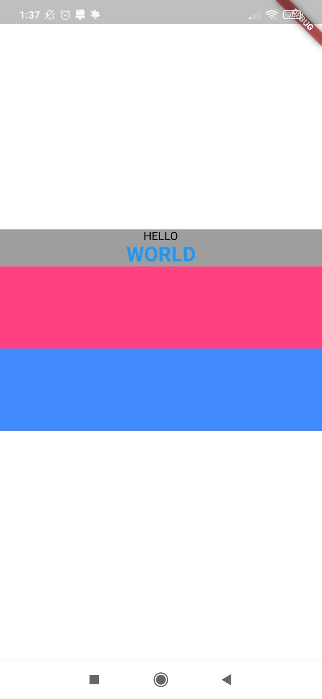

# Widgets de Flutter

## Índice
1. [¿Qué es un Widget?](#id1)
2. [Widget Text](#id2)
3. [Widget Container](#id3)
4. [Widget SizedBox](#id4)
5. [Widget Column](#id5)
6. [Widget Space](#id6)
7. [Widget Expanded](#id7)
8. [Diferencia entre Space-around vs Space-evenly](#id8)
9. [Widget Row](#id9)
10. [Errores de Overflow](#id10)
11. [Widget Flexible](#id11)
12. [FlutterLogo](#id12)
13. [Alternativa al uso del widget Spacer](#id13)
14. [Slack](#id14)
15. [Scaffold](#id15)
16. [Widget SafeArea](#id16)
17. [Widget SingleChildScrollView](#id17)
18. [Widget ListView](#id18)
19. [Widget ListView.builder](#id19)
20. [Widget ListView.separated](#id20)
21. [Widget Divider](#id21)
22. [Fuentes personalizadas](#id22)
23. [Iconos](#id23)
24. [CupertinoApp](#id24)
25. [Imágenes](#id25)  
    1. [Image.asset (Imágenes de assets)](#id251)
    2. [Image.network (Imágenes de internet)](#id252)
    3. [cached_network_image (Imágenes de internet con cache)](#id253)
26. [Widget SvgPicture](#id26)
27. [Widget ClipRRect](#id27)
28. [Hacer que un widget aparezca o desaparezca vía variable](#id28)
29. [Widget DevicePreview](#id29)
30. [Widget Wrap](#id30)
31. [Widget FittedBox](#id31)
32. [Widget AspectRatio](#id32)


<div id='id1' />

## ¿Qué es un Widget?

En Flutter, un widget es un objeto temporal usado para construir una presentación de la aplicación en su estado actual.  
Los widgets se organizan en forma de árbol, tal como poder observar en la siguiente imagen:

{ width=300 }

<div id='id2' />

## Widget Text

- Hacer que el texto se alinee según el tipo de escritura del lenguaje

``` dart
class MyApp extends StatelessWidget {
  const MyApp({super.key});

  // This widget is the root of your application.
  @override
  Widget build(BuildContext context) {
    return const MaterialApp(
        home: Center(
        child: DefaultTextStyle(
          style: TextStyle(),
          child: Directionality(
            textDirection: TextDirection.rtl,
            child: Text(
              "Lorem Ipsum is simply dummy text of the printing and typesetting industry.",
              style: TextStyle(
                fontSize: 50,
                color: Colors.white,
              ),
              textAlign: TextAlign.start,
            ),
          )),
    ));
  }
}
```

- Hacer que el texto muestre una señal indicando que hay overflow con un máximo de líneas predeterminado

``` dart
class MyApp extends StatelessWidget {
  const MyApp({super.key});
  
  @override
  Widget build(BuildContext context) {
    return const MaterialApp(
        home: Center(
        child: DefaultTextStyle(
          style: TextStyle(),
          child: Text(
            "Lorem Ipsum is simply dummy text "
            "of the printing and typesetting industry."
            ,
            maxLines: 2,
            overflow: TextOverflow.ellipsis,
            style: TextStyle(
              fontSize: 30.0,
              color: Colors.white,
            ),
            textAlign: TextAlign.center,
          )),
    ));
  }
}
```

- Añadir un padding al texto. Existen tres tipos: only, all y symmetric

``` dart
class MyContainer extends StatelessWidget {
  @override
  Widget build(BuildContext context) {
    return DefaultTextStyle(
      style: TextStyle(),
      child: Center(
        child: Container(
          width: 200.0,
          height: 200.0,
          color: Colors.white,
          alignment: Alignment.bottomCenter,
          padding: const EdgeInsets.symmetric(
            horizontal: 30,
          ),
          child: const Text(
            "Darwin Morocho",
            style: TextStyle(color: Colors.black),
          ),
        ),
      ),
    );
  }
}
```

<div id='id3' />

## Widget Container

- **Decoration**. BorderRadius.only

``` dart
borderRadius: BorderRadius.only(
  topLeft: Radius.elliptical(50, 20),
  bottomRight: Radius.circular(10),
),
```

<div style="text-align: center;">
    
</div>


- **Decoration**. BorderRadius.horizontal

``` dart
borderRadius: BorderRadius.horizontal(
  left: Radius.circular(20),
  right: Radius.circular(50),
),
```

<div style="text-align: center;">
    
</div>


- **Decoration**. BorderRadius.vertical

``` dart
borderRadius: BorderRadius.vertical(
  top: Radius.circular(10),
  bottom: Radius.circular(30),
),
```

<div style="text-align: center;">
    
</div>


- **Decoration**. Hacer que un Container tenga forma circular.

``` dart
decoration: const BoxDecoration(
  color: Colors.white,
  shape: BoxShape.circle,
),
```

<div style="text-align: center;">
    
</div>

- **Decoration**. Doble sombra personalizadas de un Container.

``` dart
decoration: BoxDecoration(
  color: Colors.white,
  shape: BoxShape.circle,
  boxShadow: [
    BoxShadow(
      color: Colors.blue.withOpacity(.5),
      blurRadius: 50,
      spreadRadius: 100,
    ),
    BoxShadow(
      color: Colors.red.withOpacity(.5),
      blurRadius: 10,
    ),
  ],
),
```

<div style="text-align: center;">
    
</div>


- **Decoration**. Sombra personalizada y desplazada en una dirección negativa (x) y una positiva (y)

``` dart
decoration: BoxDecoration(
  color: Colors.white,
  shape: BoxShape.circle,
  boxShadow: [
    BoxShadow(
      color: Colors.blue.withOpacity(
        .5,
      ),
      blurRadius: 10,
      offset: const Offset(-10, 10),
    ),
  ],
),
```

<div style="text-align: center;">
    
</div>


- **Decoration**. Gradiente de varios colores, con dirección y porcentaje de predominancia personalizada

``` dart
decoration: BoxDecoration(
  color: Colors.white,
  shape: BoxShape.circle,     
  gradient: const LinearGradient(
    colors: [
      Colors.yellow,
      Colors.blue,
      Colors.red,
    ],
    begin: Alignment.topCenter,
    end: Alignment.bottomCenter,
    stops: [
      0.5,
      0.75,
      1,
    ],
  ),
  boxShadow: [
    BoxShadow(
      color: Colors.blue.withOpacity(
        .5,
      ),
      blurRadius: 10,
      offset: const Offset(-10, 10),
    ),
  ],
),
```

<div style="text-align: center;">
    
</div>


- **Decoration**. Gradiente de tipo RadialGradient de varios colores, con dirección y porcentaje de predominancia personalizada

``` dart
decoration: BoxDecoration(
  color: Colors.white,
  shape: BoxShape.circle,     
  gradient: RadialGradient(
    colors: [
      Colors.white,
      Colors.blue.withOpacity(0.2),
      Colors.blue,
    ],
    stops: const [
      0.6,
      0.95,
      1,
    ]
  ),
  boxShadow: [
    BoxShadow(
      color: Colors.blue.withOpacity(
        .5,
      ),
      blurRadius: 10,
      offset: const Offset(-10, 10),
    ),
  ],
),
```

<div style="text-align: center;">
    
</div>

- **padding vs margin**

``` dart
child: Container(
  color: Colors.red,
  margin: const EdgeInsets.symmetric(
    horizontal: 10,
    vertical: 50,
  ),
  padding: const EdgeInsets.symmetric(
    horizontal: 30,
  ),
  child: const Text(
    "Patata armadillo",
    style: TextStyle(color: Colors.black),
  ),
),
```

<div style="text-align: center;">
    
</div>

<div id='id4' />

## Widget SizedBox

SizedBox es un widget parecido a un Container que consume menos recursos y cuyo único objetivo es proporcionar unas dimensiones. Dentro de un Container, si no se define el alignment sus elementos tenderán a expandirse lo máximo posible, ignorando el width y height, como podemos observar en el siguiente caso practico.

``` dart
class MyContainer extends StatelessWidget {
  @override
  Widget build(BuildContext context) {
    return Container(
      color: Colors.white,
      alignment: Alignment.center,
      child: DefaultTextStyle(
        style: TextStyle(),
        child: SizedBox(
            width: 300.0,
            height: 500.0,
          child: Container(
            width: 200.0,
            height: 200.0,
            color: Colors.red,
            alignment: Alignment.center,
            padding: const EdgeInsets.symmetric(
              horizontal: 30,
            ),
            child: const Text(
              "Patata",
              style: TextStyle(color: Colors.black),
            ),
          ),
        ),
      ),
    );
  }
}
```

<div style="text-align: center;">
    
</div>

<div id='id5' />

## Widget Column

- **Utilizando MainAxisSize**, el cual estableciéndolo en MainAxisSize.min permite evitar que el column se expanda verticalmente hasta ocupar todo el Container que lo contiene.

``` dart
class MyColumn extends StatelessWidget {
  const MyColumn({super.key});

  @override
  Widget build(BuildContext context) {
    return DefaultTextStyle(
      style: const TextStyle(
        color: Colors.black,
      ),
      child: Container(
        color: Colors.white,
        padding: const EdgeInsets.symmetric(
          vertical: 55,
        ),
        child: Center(
          child: Container(
            color: Colors.grey,
            child: Column(
              mainAxisSize: MainAxisSize.min,
              children: [
                const Text("HELLO"),
                const Text("WORLD", style: TextStyle(
                  color: Colors.blue,
                  fontSize: 25,
                  fontWeight: FontWeight.bold,
                  ),
                ),
                Container(
                  height: 100,
                  color: Colors.pinkAccent,
                ),
                Container(
                  height: 100,
                  color: Colors.blueAccent,
                ),
              ],
            ),
          ),
        ),
      ),
    );
  }
}
```

<div style="text-align: center;">
    
</div>

Existe una opción parecida llamada `mainAxisAlignment: MainAxisAlignment.center`, la cual nos permite personalizar como queremos que se organicen los elementos dentro del column verticalmente (siempre que este tenga una altura dinámica, empleando mainAxisSizew: MainAxisSize.max)

<div id='id6' />

## Widget Space

Solo se puede utilizar dentro de un Column o Row con MainAxisSize.max y ocupa todo el espacio que queda libre en la columna o fila en un solo lugar.

``` dart
class MyColumn extends StatelessWidget {
  const MyColumn({super.key});

  @override
  Widget build(BuildContext context) {
    return DefaultTextStyle(
      style: const TextStyle(
        color: Colors.black,
      ),
      child: Container(
        color: Colors.white,
        padding: const EdgeInsets.symmetric(
          vertical: 55,
        ),
        child: Center(
          child: Container(
            color: Colors.grey,
            child: Column(
              children: [
                const Text("HELLO"),
                const Text(
                  "WORLD",
                  style: TextStyle(
                    color: Colors.blue,
                    fontSize: 25,
                    fontWeight: FontWeight.bold,
                  ),
                ),
                const Spacer(),
                Container(
                  height: 100,
                  color: Colors.pinkAccent,
                ),
                Container(
                  height: 100,
                  color: Colors.blueAccent,
                ),
              ],
            ),
          ),
        ),
      ),
    );
  }
}
```

<div style="text-align: center;">
    
</div>

<div id='id7' />

## Widget Expanded

Permite expandir un container ocupando todo el espacio sobrante dentro de un Column o de un Row, restando la parte ocupada por otros elementos que se contengan.

``` dart
class MyColumn extends StatelessWidget {
  const MyColumn({super.key});

  @override
  Widget build(BuildContext context) {
    return DefaultTextStyle(
      style: const TextStyle(
        color: Colors.black,
      ),
      child: Container(
        color: Colors.white,
        padding: const EdgeInsets.symmetric(
          vertical: 55,
        ),
        child: Center(
          child: Container(
            color: Colors.grey,
            child: Column(
              children: [
                Container(
                  height: 50,
                  color: Colors.blueAccent,
                ),
                Expanded(
                  child: Container(
                    color: Colors.pinkAccent,
                  ),
                ),
                Container(
                  height: 50,
                  color: Colors.yellow,
                ),
              ],
            ),
          ),
        ),
      ),
    );
  }
}
```

<div style="text-align: center;">
    
</div>

**Expanded** cuenta con un parámetro llamado flex, el cual permite determinar cuanto ocupa el Expanded cuando hay más de uno. El calculo del espacio ocupado se realiza sumando todos los flex y dividiendo la pantalla en esa cantidad de espacios imaginarios. A continuación, cada Expanded ocupa el número de espacios establecidos en su parámetro flex.

``` dart
child: Column(
  children: [
    Expanded(
      flex: 3,
      child: Container(
        color: Colors.pinkAccent,
      ),
    ),
    Expanded(
      flex: 2,
      child: Container(
        color: Colors.blue,
      ),
    ),
    Expanded(
      flex: 1,
      child: Container(
        color: Colors.yellow,
      ),
    ),
  ],
),
```

<div style="text-align: center;">
    
</div>

<div id='id8' />

## Diferencia entre Space-around vs Space-evenly

En el **space-evenly**, el espacio vacío entre los elementos siempre es igual. Sin embargo, en el **space-around**, solo los elementos internos tendrán el mismo espacio entre sí. Al primer y último elemento solo se le asignará la mitad del espacio. Dando la apariencia visual de estar más disperso.

<div style="text-align: center;">
    
</div>

<div id='id9' />

## Widget Row

**Row** funciona de una manera muy similar a **Column**, solo que en este caso los elementos se alinean de forma horizontal.

``` dart
class MyRow extends StatelessWidget {
  const MyRow({super.key});
  
  @override
  Widget build(BuildContext context) {
    return Container(
      color: Colors.white,
      child: Center(
        child: Row(
          mainAxisAlignment: MainAxisAlignment.spaceBetween,
          crossAxisAlignment: CrossAxisAlignment.center,
          mainAxisSize: MainAxisSize.min,
          children: [
            Container(
              width: 50,
              height: 50,
              color: Colors.red,
            ),
            Container(
              width: 50,
              height: 100,
              color: Colors.yellow,
            ),
            Container(
              width: 50,
              height: 50,
              color: Colors.blue,
            ),
          ],
        ),
      ),
    );
  }
}
```

<div style="text-align: center;">
    
</div>

**crossAxisAlignment** nos permite establecer la alineación vertical de los elementos dentro de un Row.

``` dart
crossAxisAlignment: CrossAxisAlignment.stretch,
```

En este ejemplo, podemos observar una de las opciones disponibles la cual es `CrossAxisAlignment.stretch`. Nos permite hacer que todos los elementos dentro de un Row se expandan todo lo posible de forma vertical. El limite lo impondrá el container donde se encuentre el Row.

<div id='id10' />

## Errores de Overflow

<table>
<tr>
    <td>Errores que se dan cuando un widget o un conjunto de widgets no caben dentro de un contenedor o cualquier otro tipo de contenedor que defina unas dimensiones.<br/><br/>
    Estos errores solo serán visibles en modo debug. En caso de compilarse una versión de release no se mostraría al usuario final.<br/><br/>
    Como podemos observar, nos indica hacía que lado de la pantalla sobre sale el widget y cuantos pixeles de longitud (Puede variar dependiendo del dispositivo)
    </td>
    <td></td>
</tr>
</table>

También puede darse el caso de Overflow no solo con los limites de la pantalla. A continuación podemos ver por ejemplo un error de Overflow con un SizedBox.


``` dart
class MyRow extends StatelessWidget {
  const MyRow({super.key});
  
  @override
  Widget build(BuildContext context) {
    return Container(
      color: Colors.white,
      alignment: Alignment.centerLeft,
      child: SizedBox(
        width: 300,
        child: Row(
          mainAxisAlignment: MainAxisAlignment.spaceBetween,
          crossAxisAlignment: CrossAxisAlignment.center,
          children: [
            Container(
                width: 450,
                height: 50,
                color: Colors.blue,
              ),
          ],
        ),
      ),
    );
  }
}
```

<div style="text-align: center;">
    
</div>


Si por ejemplo un texto produce un error de Overflow en una Row, una posible solución puede ser introducirlo dentro de un Container, SizedBox o Expanded que determine su ancho máximo. De este modo, el texto realizara los saltos de linea de forma automática al llegar al limite.

``` dart
const Expanded(
  child: Text("lalala"),
),
```

<div id='id11' />

## Widget Flexible

Nos permite cambiar el tamaño de los widgets contenidos en él, evitando de este modo los errores de Overflow y la adaptabilidad a los diferentes tamaños y formatos de pantallas/ventanas.

Un dato curioso es que de este widget se hereda Expanded. Por ello tienen un comportamiento parecido.

En **Expanded** se ignora por completo el ancho y el alto de los componentes incluidos en él. De este modo, se expanden todo lo posible. En cambio, en **Flexible** si se tienen en cuenta las dimensiones de los elementos que se encuentran en su interior, de tal modo que si se produce un Overflow, este widget reduce automáticamente el tamaño de dichos elementos para que quepan dentro de la pantalla o contenedor, pero nunca los expande de más a menos que lo indiquemos expresamente.

<div style="text-align: center;">
    
</div>

Se puede hacer que un Flexible tenga el mismo comportamiento que un Expanded añadiendo el parámetro:

``` dart
fit: FlexFit.tight,
```

También, al igual que con Expanded, disponemos de la posibilidad de utilizar el parámetro flex. De este modo podremos dividir nuestro Row o Column en secciones por “peso”.

A continuación, podremos ver un ejemplo de un caso práctico de como se podría emplear este widget, utilizando los dos tipos de Flexible (loose y tight) existentes y el parámetro Flex.

### Ejemplo:

``` dart
class MyRow extends StatelessWidget {
  const MyRow({super.key});

  @override
  Widget build(BuildContext context) {
    return DefaultTextStyle(
      style: const TextStyle(color: Colors.black),
      child: Container(
        color: Colors.white,
        alignment: Alignment.centerLeft,
        child: Row(
          mainAxisAlignment: MainAxisAlignment.spaceBetween,
          crossAxisAlignment: CrossAxisAlignment.center,
          children: [
            Flexible(
              fit: FlexFit.tight,
              child: Container(
                width: 50,
                height: 50,
                color: Colors.blue,
              ),
            ),
            Flexible(
              child: Container(
                width: 170,
                height: 50,
                color: Colors.red,
              ),
            ),
            Flexible(
              flex: 3,
              child: Container(
                width: 320,
                height: 50,
                color: Colors.yellow,
              ),
            ),
          ],
        ),
      ),
    );
  }
}
```

<div style="text-align: center;">
    
    
</div>

Como dato curioso, podemos establecer la anchura en infinita (expansiva hasta los límites sin requerir de un alignment) con el siguiente parámetro:

<div id='id12' />

## FlutterLogo

El funcionamiento de este Widget es muy simple. Nos permite mostrar por pantalla el logo de Flutter, con el cual podremos realizar pruebas de interfaz.

``` dart
class MyColumn extends StatelessWidget {
  const MyColumn({super.key});

  @override
  Widget build(BuildContext context) {
    return DefaultTextStyle(
      style: const TextStyle(color: Colors.black),
      child: Container(
          color: Colors.white,
          padding: const EdgeInsets.symmetric(
            vertical: 55,
          ),
          child: const Center(  
            child: FlutterLogo(size: 200),
          ),
        ),
    );
  }
}
```

<div style="text-align: center;">
    
</div>

<div id='id13' />

## Alternativa al uso del widget Spacer

Una forma alternativa evitando el uso de Spacer es introduciendo un Row dentro de otro Row de nivel superior.

<div style="text-align: center; float: right; margin-left: 10px;">
    
</div>

``` dart
class MyRow extends StatelessWidget {
  const MyRow({super.key});

  @override
  Widget build(BuildContext context) {
    return DefaultTextStyle(
      style: const TextStyle(color: Colors.black),
      child: Container(
        color: Colors.white,
        alignment: Alignment.centerLeft,
        child: const Row(
          mainAxisAlignment: MainAxisAlignment.spaceBetween,
          crossAxisAlignment: CrossAxisAlignment.center,
          children: [
            FlutterLogo(
              size: 100,
            ),
            Row(
              children: [
                FlutterLogo(
                  size: 100,
                ),
                FlutterLogo(
                  size: 100,
                ),
              ],
            )
          ],
        ),
      ),
    );
  }
}
```

<div id='id14' />

## Slack

Este widget nos permite superponer una serie de widget hijos sobre otros, siendo una lista ordenada según la prioridad de cual está más arriba.

Como dato curioso, es posible aplicar un **AlignmentDirectional** para configurar la orientación izquierda/derecha según el idioma de la aplicación lo requiera, al igual que vimos con los textos anteriormente.

<div style="text-align: center; float: right; margin-left: 10px;">
    
</div>

``` dart
class MyStack extends StatelessWidget {
  const MyStack({super.key});

  @override
  Widget build(BuildContext context) {
    return DefaultTextStyle(
      style: const TextStyle(
        color: Colors.black,
      ),
      child: Container(
        color: Colors.white,
        child: Center(
          child: Container(
            color: Colors.grey,
            width: 400,
            height: 500,
            child: Stack(
              alignment: Alignment.center,
              children: [
                Container(
                  width: 150,
                  height: 150,
                  color: Colors.green,
                ),
                Container(
                  width: 50,
                  height: 50,
                  color: Colors.red,
                ),
                const Text("hi"),
              ],
            ),
          ),
        ),
      ),
    );
  }
}
```

Dentro de un Stack es posible ubicar los widgets donde queramos de forma libre, empleando Positioned.

<div style="text-align: center; float: right; margin-left: 10px;">
    
</div>

``` dart
class MyStack extends StatelessWidget {
  const MyStack({super.key});

  @override
  Widget build(BuildContext context) {
    return DefaultTextStyle(
      style: const TextStyle(
        color: Colors.black,
      ),
      child: Container(
        color: Colors.white,
        child: Center(
          child: Container(
            color: Colors.grey,
            child: Stack(
              alignment: Alignment.center,
              children: [
                Container(
                  color: Colors.blue,
                  width: 300,
                  height: 100,
                ),
                Container(
                  color: Colors.green,
                  height: 100,
                  child: const Text("GREEN"),
                ),
                const Positioned(
                    right: -50,
                    child: FlutterLogo(
                      size: 100,
                    )),
                const Positioned(
                  bottom: 0,
                  child: Text("hi"),
                ),
              ],
            ),
          ),
        ),
      ),
    );
  }
}
```

<div id='id15' />

## Scaffold

Este widget solo está presente en el paquete MaterialApp y nos permite definir la estructura básica de una pantalla.

<div style="text-align: center; float: right; margin-left: 10px;">
    
</div>

``` dart
class MyScaffold extends StatelessWidget {
  const MyScaffold({super.key});

  @override
  Widget build(BuildContext context) {
    return Scaffold(
      appBar: AppBar(
        systemOverlayStyle: const SystemUiOverlayStyle(
          statusBarBrightness: Brightness.dark,
          statusBarColor: Colors.indigo,
        ),
        backgroundColor: Colors.grey,
        titleTextStyle: const TextStyle(
          color: Colors.black,
          fontSize: 18,
        ),
        title: const Row(
          mainAxisSize: MainAxisSize.min,
          children: [
            Text("Flutter "),
            Text(
              "App",
              style: TextStyle(
                fontWeight: FontWeight.bold,
              ),
            ),
          ],
        ),
      ),
    );
  }
}
```


El parámetro **statusBarBrightness** nos permite determinar si los iconos de la barra de notificaciones deben estar en tono claro “Brightness.dark” o tono oscuro “Brightness.light”. Parece contradictorio, pero hay que verlo desde la perspectiva de que por ejemplo, en caso de que usemos un fondo oscuro sería necesario que los iconos de las notificaciones estuvieran en tema claro y viceversa.

Por otra parte, es posible cambiar el color de fondo de la barra de notificaciones con el parámetro **statusBarColor**

|⚠️ **Importante** tener en cuenta que estas dos opciones de personalización no funcional igual de bien en todos los dispositivos y plataformas. Dependiendo del sistema operativo (Android/ios), la versión y la capa de personalización en el caso de Android, puede llegar a darse ciertos problemas.|
|---|

Si nos fijamos, el AppBar tiene un ligero sombreado en su parte inferior. Es posible modificar esa sombra mediante los siguientes parámetros.

``` dart
elevation: 10,
shadowColor: Colors.blue,
```

Si queremos eliminar la sombra, solo debemos establecer el parámetro elevation en 0.

****

Dentro de Scaffold nos encontramos el parámetro **drawer**, el cual nos permite implementar un menú lateral típico. Por otra parte, también disponemos de **endDrawer**, el cual cumple la misma función que el anterior, solo que en su caso el menú lateral se encuentra a la derecha. También es posible combinar ambos.

<div style="text-align: center; float: right; margin-left: 10px;">
    
</div>

``` dart
class MyScaffold extends StatelessWidget {
  const MyScaffold({super.key});

  @override
  Widget build(BuildContext context) {
    return Scaffold(
      drawer: const Drawer(),
      drawerEnableOpenDragGesture: false,
      endDrawerEnableOpenDragGesture: false,
      onDrawerChanged: (isOpen){
        print(isOpen);
      },
      onEndDrawerChanged: (isOpen){
        print("right $isOpen");
      },
      drawerEdgeDragWidth: 100,
      endDrawer: const Drawer(
        elevation: 0,
        child: Column(
          children: [
            SizedBox(
              height: 40,
            ),
            Text(
              "test@test.com",
              style: TextStyle(color: Colors.black),
            )
          ],
        ),
      ),
      appBar: AppBar( … ),
    );
  }
```

(onEnd)**drawerEnableOpenDragGesture** nos permite indicar si el menú lateral izquierdo o derecho se pueden abrir con un gesto de deslizamiento.

**DrawerEdgeDragWidth** nos permite indicar la distancia de deslizamiento a la que se puede abrir el menú lateral.

**on**(End)**DraweChanged** nos proporcionan información sobre si el menú lateral esta abierto o cerrado, pasando le una función.

****

### bottomNavigationBar

Parámetro del Scaffold el cual nos permite disponer de una barra inferior con diferentes opciones.

``` dart
bottomNavigationBar: BottomNavigationBar(
  items: const [
    BottomNavigationBarItem(icon: Icon(Icons.home), label: "Home"),
    BottomNavigationBarItem(icon: Icon(Icons.person), label: "Profile"),
  ],
),
```

### flotingActionButton / floatingButtonLocation

Parámetros del Scaffold. El primero nos permite establecer un botón flotante en la interfaz y el segundo su ubicación. En el caso del ejemplo centerDocked corresponder al limite central de la barra inferior de opciones que añadimos anteriormente.

``` dart
floatingActionButton: FloatingActionButton(
  child: const Icon(
    Icons.add,
    size: 30,
  ),
  onPressed: () {
    print("🔥");
  },
),
floatingActionButtonLocation: FloatingActionButtonLocation.centerDocked,
```

<div style="text-align: center;">
    
</div>


***

### body

Parámetros que nos permite introducir el widget que se mostrará en el body del Scaffold.

``` dart
body: Container(
  color: Colors.grey,
  width: double.infinity,
  height: double.infinity,
  child: const Column(
    children: [
      Expanded(
        child: Center(
          child: Padding(
            padding: EdgeInsets.symmetric(horizontal: 25),
            child: TextField(),
          ),
        ),
      ),
      Text("jajajajajaja"),
      SizedBox(
        height: 50,
      )
    ],
  ),
),
```

<div style="text-align: center;">
    
</div>

Dentro del Scaffold, dispondremos de una serie de  parámetros que nos permitiran personalizar ciertos aspectos del body:

- Permitir que se extienda el contenido del body por detrás del AppBar.

``` dart
extendBodyBehindAppBar: false,
```

- Permitir que se extienda el contenido del body por detrás del TopBar.

``` dart
extendBody: false,
```

- Indicar si el contenido del body se puede adapta al nuevo tamaño de pantalla al abrir el teclado.

``` dart
resizeToAvoidBottomInset: true,
```

En el AppBar dispondremos de una serie de botones con diferentes acciones. Podemos personalizar estos botones del siguiente modo.

``` dart
appBar: AppBar(
  (...)
  actions: [
    IconButton(
      onPressed: () {},
      icon: const Icon(Icons.settings),
    ),
    IconButton(
      onPressed: () {},
      icon: const Icon(Icons.logout),
    ),
  ],
  (...)
),
```

<div id='id16' />

## Widget SafeArea

Se trata de un widget el cual nos permite evitar que el contenido este por detrás del StatusBar o por debajo de un menú inferior.

<div style="text-align: center; float: right; margin-left: 10px;">
    
</div>

``` dart
class MySafeArea extends StatelessWidget {
  const MySafeArea({super.key});

  @override
  Widget build(BuildContext context) {
    return Scaffold(
      body: Container(
        width: double.infinity,
        height: double.infinity,
        color: Colors.grey,
        child: SafeArea(
          child: Column(
            children: [
              const Text("HELLO"),
              Expanded(
                child: Container(
                  color: Colors.red,
                ),
              ),
            ],
          ),
        ),
      ),
    );
  }
}
```

Podemos habilitar o deshabilitar la funcionalidad en los diferentes laterales del SafeArea con los siguientes parámetros: left, top, right, botton

<div id='id17' />

## Widget SingleChildScrollView

<div style="text-align: center; float: right; margin-left: 10px;">
    
</div>

``` dart
class MySingleChildScrollView extends StatelessWidget {
  const MySingleChildScrollView({super.key});

  @override
  Widget build(BuildContext context) {
    return Scaffold(
      body: SafeArea(
        bottom: false,
        child: Column(
          children: [
            Row(
              children: [
                const FlutterLogo(
                  size: 90,
                ),
                Expanded(
                  child: SingleChildScrollView(
                    scrollDirection: Axis.horizontal,
                    physics: const BouncingScrollPhysics(),
                    child: Row(
                      children: List.generate(
                        18,
                        (index) => Container(
                          color: Colors.primaries[index],
                          width: 100,
                          height: 100,
                          alignment: Alignment.center,
                          child: Text("$index"),
                        ),
                      ),
                    ),
                  ),
                ),
              ],
            ),
            Expanded(
              child: SingleChildScrollView(
                reverse: true,
                child: Column(
                  children: List.generate(
                    18,
                    (index) => Container(
                      color: Colors.primaries[index],
                      height: 100,
                      alignment: Alignment.center,
                      child: Text("$index"),
                    ),
                  ),
                ),
              ),
            )
          ],
        ),
      ),
    );
  }
}
```

El widget **SingleChildScrollView** nos permite crear una lista deslizable horizontal o vertical, para aquellas situaciones en las cuales nuestro contenido produzca overflow. Algunos de sus parámetros a destacar son:

### scrollDirection

Nos permite cambiar la dirección de deslizamiento mediante los siguientes opciones:

- Para un deslizamiento horizontal

``` dart
scrollDirection: Axis.horizontal,
```

- Para un deslizamiento vertical

``` dart
scrollDirection: Axis.vertical,
```


### physics

Permite cambiar la animación cuando el deslizamiento llega al tope. 

- Animación de resorte para todas las plataformas, la cual es nativa de iOS.

``` dart
physics: const BouncingScrollPhysics()
```

- Sin animación

``` dart
physics: const NeverScrollableScrollPhysics(),
```


### reverse

Puede darse el caso en el que necesitemos que la lista cuando se muestre por primera vez, se encuentre al final del todo. Con este parámetro booleano podremos indicar si deseamos que inicie al final de todo.

``` dart
reverse: true,
```

***

### keyboardDismissBehavior

Con este parámetro podemos indicar el comportamiento que tendrá el teclado del dispositivo móvil cuando la lista se deslice. Con el siguiente ejemplo podemos hacer que cuando se haga un desplazamiento y el teclado se encuentre abierto, este se oculte automáticamente.

``` dart
keyboardDismissBehavior: ScrollViewKeyboardDismissBehavior.onDrag,
```


### padding

Este parámetro nos permite agregar un padding en cierto modo un poco especial. Se caracteriza por mostrarse en todos los laterales, salvo el que haría overflow, hacia el cual se desplaza la lista.

``` dart
padding: const EdgeInsets.all(8),
```

<div style="text-align: center;">
    
</div>

**EdgeInsets** dispone de un método especial llamado **copyWith** el cual nos permite combinar diferentes parámetros. Por ejemplo, podemos usar horizontal junto con top.

``` dart
padding: const EdgeInsets.symmetric(
  horizontal: 20,
).copyWith(
  top: 15,
),
```

<div id='id18' />

## Widget ListView

Cumple la misma función que **SingleChildScrollView** y tiene casi los mismos parámetros que vimos anteriormente, con la diferencia de que requiere menos código al no ser necesario agregar un Column y que está mejor optimizado. Para listas largas de widgets es la mejor opción, pues los elementos que no están visibles no se cargar, ahorrando de este modo una gran cantidad de recursos.

<div style="text-align: center; float: right; margin-left: 10px;">
    
</div>

``` dart
class MyListView extends StatelessWidget {
  const MyListView({super.key});

  @override
  Widget build(BuildContext context) {
    return Scaffold(
      body: SafeArea(
        child: Column(
          children: [
            SizedBox(
              height: 150,
              child: ListView(
                scrollDirection: Axis.horizontal,
                children: List.generate(
                  18,
                  (index) => Container(
                    width: 100,
                    height: 150,
                    color: Colors.primaries[index],
                    alignment: Alignment.center,
                    child: Text("$index"),
                  ),
                ),
              ),
            ),
            Expanded(
              child: ListView(
                children: List.generate(
                  18,
                  (index) => Container(
                    width: 100,
                    height: 150,
                    color: Colors.primaries[index],
                    alignment: Alignment.center,
                    child: Text("$index"),
                  ),
                ),
              ),
            ),
          ],
        ),
      ),
    );
  }
}
```

***

### shrinkWrap

Este parámetro permite hacer que el tamaño del widget se rija por sus elementos hijos, teniendo unicamente el tamaño necesario para contenerlos.

``` dart
shrinkWrap: true,
```

***

Existe otro tipo de **ListView**, los cuales nos permiten optimizar la carga de widgets en los casos en los cuales el número de elementos sea muy elevado y no valga la pena renderizarlos si no se están mostrando en pantalla.

<div id='id19' />

## Widget ListView.builder

Solo renderiza en tiempo real los widget mostrados por pantalla. Internamente realiza los cálculos automáticamente sobre el número de elementos que debe renderizar.

``` dart
class MyListViewBuilder extends StatelessWidget {
  const MyListViewBuilder({super.key});

  @override
  Widget build(BuildContext context) {
    return Scaffold(
      appBar: AppBar(),
      body: ListView.builder(
        itemBuilder: (_, int index) {
          print("🔥");
          return Container(
            height: 100,
            color: Colors.green,
            alignment: Alignment.center,
            margin: const EdgeInsets.all(5),
            child: const FlutterLogo(),
          );
        },
        itemCount: 1000000,
      ),
    );
  }
}
```

<div id='id20' />

## Widget ListView.separated

Tiene la misma funcionalidad que **ListView.builder**, con la peculiaridad de que dispone de un parámetro que permite establecer un Widget delimitador. Como se puede observar en el ejemplo, el delimitador es una linea con el número de caracteres del texto localizado en el Container superior.

<div style="text-align: center; float: right; margin-left: 10px;">
    
</div>

``` dart
class MyListViewBuilder extends StatelessWidget {
  const MyListViewBuilder({super.key});

  @override
  Widget build(BuildContext context) {
    final names = ["Darwin", "Lulu", "Pepe"];

    return Scaffold(
      appBar: AppBar(),
      body: ListView.separated(
        itemBuilder: (_, int index) {
          final name = names[index];
          print("🔥");
          return Container(
            height: 100,
            alignment: Alignment.center,
            margin: const EdgeInsets.all(5),
            child: Text(name),
          );
        },
        itemCount: names.length,
        separatorBuilder: (_, int index) {
          return Row(
            children: [
              Expanded(
                child: Container(
                  height: 2,
                  color: Colors.black38,
                ),
              ),
              Padding(
                padding: const EdgeInsets.all(8.0),
                child: Text("${names[index].length}"),
              ),
              Expanded(
                child: Container(
                  height: 2,
                  color: Colors.black38,
                ),
              ),
            ],
          );
        },
      ),
    );
  }
}
```

<div id='id21' />

## Widget Divider

Este Widget es empleado comúnmente como delimitador. Permite crear una linea separadora de manera sencilla.

``` dart
const Divider();
```

<div id='id22' />

## Fuentes personalizadas

Un lugar seguro para obtener fuentes de texto podría ser el siguiente sitio perteneciente a Google:

[fonts.google.com](https://fonts.google.com/)

La familia de fuente descargada estará formada por diferentes archivos. Cada uno correspondiente a un estilo, teniendo la extensión de archivo “.ttf”. Dichos archivos debemos guardarlos dentro de nuestra carpeta de proyecto, en la siguiente ruta:

`assets/fonts/”nombre_fuente”/..`

<div style="text-align: center;">
    
</div>

En caso de que la carpeta assets o la la subcarpeta fonts no existan, será necesario crearlas manualmente.

Una vez tenemos las fuentes, el siguiente paso sería configurarla. Para esto 
debemos dirigirnos al archivo **pubspec.yaml** y agregar el siguiente apartado.

``` yaml
fonts:
  - family: Nunito Black
    fonts:
      - asset: assets/fonts/nunito/Nunito-Black.ttf
      - asset: assets/fonts/nunito/Nunito-BlackItalic.ttf
        style: italic
```

De este modo, determinamos el nombre personalizado de nuestra fuente, el archivo de fuente de la carpeta asset que vamos a emplear y a que estilo va a pertenecer. Por ejemplo, en el caso superior podemos observar como primero se agrega la fuente por defecto y posteriormente la de estilo italic.

Vamos a poner a prueba su funcionamiento:

``` dart
class CustomFont extends StatelessWidget {
  const CustomFont({super.key});

  @override
  Widget build(BuildContext context) {
    return Scaffold(
      body: SafeArea(
        child: ListView(
          padding: const EdgeInsets.all(20),
          children: const [
            Text(
              '''
Lorem Ipsum is simply dummy text of the printing and
typesetting industry. Lorem Ipsum has been the industry's
standard dummy text ever since the 1500s, when an unknown
printer took a galley of type and scrambled it to make a
type specimen book. It has survived not only five centuries,
  ''',
              style: TextStyle(
                fontFamily: 'Nunito Black',
                fontStyle: FontStyle.italic
              ),
            ),
          ],
        ),
      ),
    );
  }
}
```

<div style="text-align: center;">
    
</div>

***

A continuación, veremos un ejemplo más detallado y completo de la implementación de una fuente personalizada. En este caso con el añadido de que tendremos en cuenta el weight

Dentro del archivo **pubspec.yaml**

``` yaml
fonts:
  - family: Nunito
    fonts:
      - asset: assets/fonts/nunito/Nunito-ExtraLight.ttf
        weight: 200
      - asset: assets/fonts/nunito/Nunito-ExtraLightItalic.ttf
        weight: 200
        style: italic
      - asset: assets/fonts/nunito/Nunito-Light.ttf
        weight: 300
      - asset: assets/fonts/nunito/Nunito-Italic.ttf
        weight: 300
        style: italic
      - asset: assets/fonts/nunito/Nunito-Regular.ttf
        weight: 400
      - asset: assets/fonts/nunito/Nunito-Medium.ttf
        weight: 500
      - asset: assets/fonts/nunito/Nunito-MediumItalic.ttf
        weight: 500
        style: italic
      - asset: assets/fonts/nunito/Nunito-SemiBold.ttf
        weight: 600
      - asset: assets/fonts/nunito/Nunito-SemiBoldItalic.ttf
        weight: 600
        style: italic
      - asset: assets/fonts/nunito/Nunito-Bold.ttf
        weight: 700
      - asset: assets/fonts/nunito/Nunito-BoldItalic.ttf
        weight: 700
        style: italic
      - asset: assets/fonts/nunito/Nunito-ExtraBold.ttf
        weight: 800
      - asset: assets/fonts/nunito/Nunito-ExtraBoldItalic.ttf
        weight: 800
        style: italic
      - asset: assets/fonts/nunito/Nunito-Black.ttf
        weight: 900
      - asset: assets/fonts/nunito/Nunito-BlackItalic.ttf
        weight: 900
        style: italic
```

Ponemos a prueba su funcionamiento.

``` dart
class CustomFont extends StatelessWidget {
  const CustomFont({super.key});

  @override
  Widget build(BuildContext context) {
    return Scaffold(
      body: SafeArea(
        child: ListView(
          padding: const EdgeInsets.all(20),
          children: const [
            Text(
              '''
Lorem Ipsum is simply dummy text of the printing and
typesetting industry. Lorem Ipsum has been the industry's
standard dummy text ever since the 1500s, when an unknown
printer took a galley of type and scrambled it to make a
type specimen book. It has survived not only five centuries,
  ''',
              style: TextStyle(
                fontFamily: 'Nunito',
                fontStyle: FontStyle.italic,
                fontWeight: FontWeight.w800,
              ),
            ),
          ],
        ),
      ),
    );
  }
}
```

<div style="text-align: center;">
    
</div>

<div id='id23' />

## Iconos

Con Flutter por defecto podemos hacer uso de los iconos de Material y de Cupertino al mismo tiempo. En las siguientes páginas podemos observar todos los iconos que están disponibles:

- **Material**

[fonts.google.com/icons](https://fonts.google.com/icons)


- **Cupertino**

[api.flutter.dev/flutter/cupertino/CupertinoIcons-class.html](https://api.flutter.dev/flutter/cupertino/CupertinoIcons-class.html)

Ejemplo utilizando un icono de Material y otro de Cupertino

<div style="text-align: center; float: right; margin-left: 10px;">
    
</div>

``` dart
class CustomIcons extends StatelessWidget {
  const CustomIcons({super.key});

  @override
  Widget build(BuildContext context) {
    return const Scaffold(
      body: SafeArea(
        child: Center(
          child: Row(
            mainAxisAlignment: MainAxisAlignment.center,
            children: [
              Icon(
                Icons.abc,
                size: 100,
                color: Colors.blueAccent,
                semanticLabel: 'icono abc',
              ),
              Icon(
                CupertinoIcons.ant,
                size: 100,
                color: Colors.black,
                semanticLabel: 'icono hormiga',
              ),
            ],
          ),
        ),
      ),
    );
  }
}
```

### semanticLabel

Este es un parámetro especial presente en muchos widget. En él debemos agregar un texto descriptivo que sirva de guiá para personas ciegas o con problemas de visión. Dicho texto será usado por herramientas de guia, como pueden ser Google **TalkBack** o **VoiceOver** de Apple.

***

- **¿De dónde puedo descargar iconos?**

  - En formato png y svg (esta última solo e la versión premium)  
  [flaticon.es](https://www.flaticon.es/)

  - En formato svg  
  [svgrepo.com/collection/dazzle-line-icons](https://www.svgrepo.com/collection/dazzle-line-icons/)

Es importante tener en cuenta que los iconos de colores no son compatibles con el widget Icon. Los que descarguemos deben ser mono color.

- **¿Cómo puedo pasar un png a svg?**

Para este caso podemos hacer uso de la siguiente página.

https://www.pngtosvg.com/

- **¿Cómo puedo crear mi propio paquete de iconos?**

Es posible crear un paquete de iconos personalizado a través de la siguiente página web. 

https://www.fluttericon.com/

Es importante disponer antes de las imágenes svg que vamos a utilizar, siendo estas monocolor. Si no se cumple esta última característica, podemos adaptar las imágenes en https://www.pngtosvg.com/ página vista en la pregunta anterior.


Desde este sitio solo debemos indicar el nombre del paquete de iconos, arrastrar las imágenes e indicar el nombre para cada una. Todo esto se verá luego reflejado en el código.

Al descargar el paquete creado, tendremos un comprimido con la siguiente carpeta.

<div style="text-align: center;">
    
</div>

Para implementar el paquete debemos crear una carpeta dentro de assets llamada “icons” y meter dentro los archivos “config.json” “CustomIcons.ttf"

<div style="text-align: center;">
    
</div>

Luego, dentro de la carpeta lib debemos agregar el archivo *.dart, en este caso se ha hecho dentro de una carpeta llamada “icons”

<div style="text-align: center;">
    
</div>

Destacar que **fluttericon** ya nos añade la terminación icons. En caso de que lo pongamos, ocurrirá lo que podemos observar en la imagen superior. La terminación icons se repite.

Llegados a este punto, ya podemos hacer uso de nuestro paquete de iconos. A continuación podremos ver un ejemplo.

``` dart
import 'package:flutter/material.dart';
import '../icons/custom_icons_icons.dart' as alias;

class CustomIcons extends StatelessWidget {
  const CustomIcons({super.key});

  @override
  Widget build(BuildContext context) {
    return const Scaffold(
      body: Center(
        child: Icon(
          alias.CustomIcons.like,
          size: 75,
          color: Colors.blueAccent,
          semanticLabel: 'icono like',
        ),
      ),
    );
  }
}
```

<div style="text-align: center;">
    
</div>

<div id='id24' />

## CupertinoApp

Se trata de la linea de diseño y conjunto de elementos establecidos por Apple, siente este la “competencia” de Material creado por Google.

Tiene una clara desventaja frente a Material, siendo el nivel de personalización que se puede realizar de los elementos. Es importante recordar que no se pueden usar elementos Cupertino bajo un widget superior de Material ni viceversa.

Por ejemplo, el widget **Scaffold** pertenece a Material y no esta disponible en **Cupertino**. De este modo, en una interfaz que se base en este no se podrá usar **Scaffond** y tendremos que buscar alternativas, como puede ser **CupertinoPageScaffond**

Ejemplo de una aplicación basada en **Cupertino** empleando la alternativa a Scaffold.

<div style="text-align: center; float: right; margin-left: 10px;">
    
</div>


- **Main**

``` dart
import 'package:flutter/material.dart';
import 'package:text/widgets/custom_icons.dart';

void main() {
  runApp(const MyApp());
}

class MyApp extends StatelessWidget {
  const MyApp({super.key});

  @override
  Widget build(BuildContext context) {
    return const MaterialApp(
      home: CustomIcons(),
    );
  } 
}
```

- **Widget hijo**

``` dart
import 'package:flutter/cupertino.dart';

class MyCupertinoScaffold extends StatelessWidget {
  const MyCupertinoScaffold({super.key});

  @override
  Widget build(BuildContext context) {
    return const CupertinoPageScaffold(
      child: Center(
        child: Text('cupertino'),
      ),
    );
  }
}
```

<div id='id25' />

## Imágenes

Existe diferentes maneras de mostrar una imagen dependiendo de su origen.

<div id='id251' />

### Image.asset (Imágenes de assets)

Son imágenes locales ubicadas en `assets/images`. En caso de que esta carpeta no exista, será necesario crearla manualmente. También tendremos que agregar el path de dichas imágenes dentro del archivo de configuración `pubspec.yaml`

Dentro del archivo `pubspec.yaml`

``` yaml
assets:
  - assets/images/pomni.png
```

Código de ejemplo:

<div style="text-align: center; float: right; margin-left: 10px;">
    
</div>

``` dart
class MyImages extends StatelessWidget {
  const MyImages({super.key});

  @override
  Widget build(BuildContext context) {
    return Scaffold(
      body: Center(
        child: Container(
          color: Colors.grey,
          child: Image.asset(
            'assets/images/pomni.png',
            height: 250,
          ),
        ),
      ),
    );
  }
}
```

#### fit

Con este parámetro es posible cambiar el factor de escala de la imagen.

<div style="text-align: center; float: right; margin-left: 10px;">
    
</div>

``` dart
class MyImages extends StatelessWidget {
  const MyImages({super.key});

  @override
  Widget build(BuildContext context) {
    return Scaffold(
      body: Center(
        child: Container(
          color: Colors.grey,
          child: Image.asset(
            'assets/images/pomni.png',
            height: 600,
            width: 200,
            fit: BoxFit.fill,
          ),
        ),
      ),
    );
  }
}
```

***

<div id='id252' />

### Image.network (Imágenes de internet)

Son imágenes proveniente de internet empleando una URL.

<div style="text-align: center; float: right; margin-left: 10px;">
    
</div>

``` dart
class MyImages extends StatelessWidget {
  const MyImages({super.key});

  @override
  Widget build(BuildContext context) {
    return Scaffold(
      body: Center(
        child: Container(
          color: Colors.grey,
          width: 350,
          height: 500,
          child: Image.network(
            'https://files.cults3d.com/uploaders/19712811/',
            loadingBuilder: (_, child, event) {
              if (event == null){
                return child;
              }
              return const Center(
                child: CircularProgressIndicator(),
              );
            },
          ),
        ),
      ),
    );
  }
}
```

#### loadingBuilder

Este parámetro nos permite mostrar un widget de carga mientras se termina de descargar la imagen de internet. De este modo, por ejemplo podemos hacer uso del widget **CircularProgressIndicator()**. 

En el ejemplo superior podemos ver la manera correcta de utilizarlo. El parámetro event es nulo cuando la imagen se termino de cargar. Por otra parte, el parámetro child es la imagen descargada que tendremos que mostrar.

***

<div id='id253' />

### cached_network_image (Imágenes de internet con cache)

**Image.network** aunque cumple con su finalidad, no es lo suficientemente eficiente. No puede (o tiene muchos problemas) para cachear las imágenes, lo cual lo hace bastante ineficiente pues cada vez que se cargue la imagen se volverá a descargar de internet.

Una posible solución es utilizar **cached_network_image**, una famosa dependencia de terceros que solventa este problema presente en **Image.network**

Dentro del `fichero pubspec.yaml`

``` yaml
dependencies:
  flutter:
    sdk: flutter
  cupertino_icons: ^1.0.2
  cached_network_image: ^3.3.0
```

Veamos un ejemplo de como funciona.

<div style="text-align: center; float: right; margin-left: 10px;">
    
</div>

``` dart
class MyImages extends StatelessWidget {
  const MyImages({super.key});

  @override
  Widget build(BuildContext context) {
    return Scaffold(
      body: Center(
        child: Container(
          color: Colors.grey,
          width: 350,
          height: 500,
          child: CachedNetworkImage(
            imageUrl: "https://via.placeholder.com/350x150",
            placeholder: (_, __) => const Center(
              child: CircularProgressIndicator(),
            ),
            errorWidget: (_, __, error) => const Icon(
              Icons.error,
            ),
          ),
        ),
      ),
    );
  }
}
```

#### placeholder

Con este parámetro podemos agregar un widget que se muestre mientras se está descargando al imagen, para hacer la espera más amena. No es necesario controlar el evento como ocurre en **loadingBuilder** con **Image.network**

#### errorWidget

Este parámetro permite determinar el widget que se mostrará en caso de que ocurra un error al cargar la imagen. Dispone de un parámetro de tipo Object el cual contiene un mensaje de error, el cual nos permite determinar la causa del problema. No es recomendable por cuestiones de seguridad mostrar dicha información en producción.

<div id='id26' />

## Widget SvgPicture

Con este widget podemos solucionar el problema de incompatibilidad a la hora de mostrar imágenes SVG. Se debe implementar su dependencia `flutter_svg: ^2.0.9`

``` dart
SvgPicture.asset(
  'assets/logos/facebook.svg',
  color: Colors.blueAccent,
  width: 150,
)
```

Las imágenes que se utilicen deben estar exportadas con _Estilo en linea_.

<div id='id27' />

## Widget CLipRRect

En Flutter no es posible modificar la forma de las imágenes utilizado directamente los parámetros de Container. Por ello, disponemos del widget **ClipRRect**, el cual si nos permite hacerlo. A continuación, podemos observar un ejemplo de como funciona.

``` dart
class Avatar extends StatelessWidget {
  final double size;
  final String asset;

  const Avatar({
    super.key,
    required this.asset,
    required this.size,
  });

  @override
  Widget build(BuildContext context) {
    return Center(
      child: ClipRRect(
        borderRadius: BorderRadius.circular(size*0.5),
        child: Image.asset(
          asset,
          width: size,
          height: size,
        ),
      ),
    );
  }
}
```

<div style="text-align: center;">
    
</div>

<div id='id28' />

## Hacer que un widget aparezca o desaparezca vía variable

Como podemos ver, es tan fácil como hacer uso de una condicional. A continuación, podemos ver un ejemplo con el badge de un botón en la práctica de Facebook UI.

``` dart
class CircleButton extends StatelessWidget {
  final Color color;
  final IconData iconData;
  final bool showBadge;

  const CircleButton({
    super.key,
    required this.color,
    required this.iconData,
    this.showBadge = false,
  });

  @override
  Widget build(BuildContext context) {
    return Center(
      child: Stack(
        children: [
          Container(
            width: 36,
            height: 36,
            decoration: BoxDecoration(
              color: color,
              shape: BoxShape.circle,
            ),
            child: Icon(
              iconData,
              color: Colors.white,
              size: 16,
            ),
          ),
          if (showBadge)
            Positioned(
              top: -3,
              right: 0,
              child: Container(
                width: 13,
                height: 13,
                decoration: BoxDecoration(
                  shape: BoxShape.circle,
                  color: Colors.red,
                  border: Border.all(
                    width: 3,
                    color: Colors.white,
                  ),
                ),
              ),
            )
        ],
      ),
    );
  }
}
```

<div style="text-align: center;">
    
</div>

<div id='id29' />

## Widget DevicePreview

Su objetivo es ser usado en producción. Nos permite ver en tiempo real como se vería la aplicación en diferentes tipos de dispositivos y plataformas. Todo esto, sin ser necesario recompilar el código ni utilizar diferentes emuladores. De este modo, se agiliza mucho el proceso de desarrollo y testing.

Dispone también de otro tipo de herramientas. Por ejemplo, podemos cambiar el tamaño de fuente del dispositivo, su idioma, la orientación o el tema.

Tras haber agregado la dependencia correspondiente `device_preview: ^1.1.0`
(podemos quitar la versión en caso de conflicto de dependencias) la manera de implementarlo es muy simple. Solo será necesario agregar el siguiente código por encima del widget principal de nuestra aplicación. También tendremos que agregar los parámetros **useInheritedMediaQuery**, **locale** y **builder** en MaterialApp.

<div style="text-align: center; float: right; margin-left: 10px;">
    
</div>

``` dart
void main() {
  runApp(
    DevicePreview(
      builder: (_) => const MyApp(),
      enabled: !kReleaseMode,
    ),
  );
}

class MyApp extends StatelessWidget {
  const MyApp({super.key});

  @override
  Widget build(BuildContext context) {
    return MaterialApp(
      useInheritedMediaQuery: true,
      locale: DevicePreview.locale(context),
      builder: DevicePreview.appBuilder,
      home: const FacebookUi(),
    );
  }
}
```

### enabled (Tipo booleano)

Este parámetro de **DevicePreview** nos permite habilitar su interfaz o deshabilitarla según lo necesitemos. Por ejemplo, cuando vayamos a realizar una compilación para producción podemos (y deberíamos) deshabilitarlo.

En el ejemplo se hace uso de una variable global **kReleaseMode**. Se trata de un tipo booleano que nos indica si estamos en modo debug o release. Esto nos permite automatizar el proceso y olvidarnos de cambiar dicho parámetro cada vez que vayamos a realizar una compilación de producción.

<div id='id30' />

## Widget Wrap

Muchas veces se nos puede dar el caso en el que un Row por ejemplo nos de un error de OverFlow. Una posible solución puede ser emplear **ListView**, sin embargo, en muchos casos esto no es posible y es necesario que todos los elementos se muestren al mismo tiempo en la pantalla, independientemente de la resolución del dispositivo.

Para solventar este problema disponemos de **Wrap**. Este widget nos acomoda los elementos en pantalla, de tal modo que si uno no cabe lo pone en una segunda fila.

<div style="text-align: center; float: right; margin-left: 10px;">
    
</div>

``` dart
class QuickActions extends StatelessWidget {
  const QuickActions({super.key});

  @override
  Widget build(BuildContext context) {
    return const Wrap(
      spacing: 10,
      runSpacing: 10,
      alignment: WrapAlignment.center,
      children: [
        QuickButton(
          color: Color(0xFF94C390),
          iconData: CustomIcons.photos,
          label: "Gallery",
        ),
        QuickButton(
          color: Color(0xFF218BF2),
          iconData: CustomIcons.user_friends,
          label: "Tag Friends",
        ),
        QuickButton(
          color: Color(0xFFF36E6D),
          iconData: CustomIcons.video_camera,
          label: "Live",
        ),
      ],
    );
  }
}
```

### spacing
Tamaño del espacio entre los elementos.

### runSpacing
Tamaño entre las filas.

### alignment
Alineación de los elementos.

<div id='id31' />

## Widget FittedBox

Este widget nos permite evitar el **OverFlow** por ejemplo de un row sin tener que emplear un ListView o un Wrap. Para conseguir esto, **FittedBox** cambia la escala de todos los elementos contenidos en él.

<div style="text-align: center; float: right; margin-left: 10px;">
    
</div>

``` dart
class QuickActions extends StatelessWidget {
  const QuickActions({super.key});

  @override
  Widget build(BuildContext context) {
    return const FittedBox(
      fit: BoxFit.scaleDown,
      alignment: Alignment.centerLeft,
      child: Row(
        children: [
          QuickButton(
            color: Color(0xFF94C390),
            iconData: CustomIcons.photos,
            label: "Gallery",
          ),
          SizedBox(width: 15),
          QuickButton(
            color: Color(0xFF218BF2),
            iconData: CustomIcons.user_friends,
            label: "Tag Friends",
          ),
          SizedBox(width: 15),
          QuickButton(
            color: Color(0xFFF36E6D),
            iconData: CustomIcons.video_camera,
            label: "Live",
          ),
        ],
      ),
    );
  }
}
```

### fit

Nos permite cambiar el comportamiento del escalado. Por ejemplo, con **BoxFit.scaleDown** podemos indicar que solo cambie el tamaño de los elementos contenidos cuando se produzca OverFlow. La opción por defecto es **BoxFit.contain**, la cual adapta siempre los elementos a la resolución de la pantalla, haciéndolos más pequeños o más grandes.

### alignment
Alineación de los elementos.

<div id='id32' />

## Widget AspectRatio

Con este widget podemos mantener la relación de aspecto de las imágenes entre diferentes resoluciones de pantalla.

``` dart
class MyAspectRatio extends StatelessWidget {
  const MyAspectRatio({super.key});

  @override
  Widget build(BuildContext context) {
    return Scaffold(
      body: Center(
        child: SizedBox(
          height: 100,
          child: AspectRatio(
            aspectRatio: 16 / 9,
            child: Image.network(
              'https://i.discogs.com/78f3xmJ3...',
              width: double.infinity,
              fit: BoxFit.cover,
            ),
          ),
        ),
      ),
    );
  }
}
```

<table>
  <tr>
    <td>Relación de aspecto no mantenida</td>
    <td>Relación de aspecto mantenida a 16:9</td>
  </tr>
  <tr>
    <td>
      
      
    </td>
    <td>
      
      
    </td>
  </tr>
</table>

### aspectRatio (double)

Con este parámetro podemos determinar la relación de aspecto.
- 1 va a dar lugar a un cuadrado.
- Mientras mayor sea el número, más rectangular de manera horizontal será.
- Mientras menor sea el número, más rectangular de manera vertical va a ser.

<div style="text-align: center;">
    
</div>