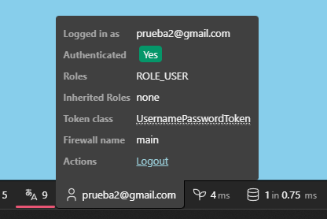

# Autenticación de usuarios

Consultar la siguiente documentación de Symfony donde se explica el tema con más detalle<https://symfony.com/doc/6.4/security.html#form-login>

Una vez tengamos la table de usuario y la gestión de como se crean podemos continuar con la configuración de la sesión de usuarios y como estos se pueden autenticar.

Debemos crear un controlador Login para gestionar el inicio de sesión y el cierre de sesión. Tendría un aspecto parecido al siguiente.

```php
namespace App\Controller;

use Symfony\Bundle\FrameworkBundle\Controller\AbstractController;
use Symfony\Component\HttpFoundation\Response;
use Symfony\Component\Routing\Attribute\Route;
use Symfony\Component\Security\Http\Authentication\AuthenticationUtils;

class LoginController extends AbstractController
{
    #[Route('/login', name: 'login')]
    public function index(AuthenticationUtils $authenticationUtils): Response
    {
        $error = $authenticationUtils->getLastAuthenticationError();
        $lastUsername = $authenticationUtils->getLastUsername();

        return $this->render('login/index.html.twig', [
            'last_username' => $lastUsername,
            'error'         => $error,
        ]);
    }

    #[Route('/logout', name: 'app_logout')]
    public function logout(AuthenticationUtils $authenticationUtils)
    {
        // Está función se debe quedar vacia
    }
}
```

Preparamos la vista asociada al controlador

```javascript


Hello Login


    
        <div>{{ error.messageKey|trans(error.messageData, 'security') }}</div>
    

    <form action="{{ path('login') }}" method="post">
        <label for="username">Email:</label>
        <input type="text" id="username" name="_username" value="{{ last_username }}" required>

        <label for="password">Password:</label>
        <input type="password" id="password" name="_password" required>

        <input type="hidden" name="_target_path" value="/">

        <button type="submit">login</button>
    </form>

```

y finalmente debemos configurar el firewall (archivo de configuración segurity.yaml) para indicarle las rutas correspondientes al login y al logout, agregando los campos form_login y logout debajo de main.

```yaml
    # https://symfony.com/doc/current/security.html#registering-the-user-hashing-passwords
    password_hashers:
        Symfony\Component\Security\Core\User\PasswordAuthenticatedUserInterface: 'auto'
    # https://symfony.com/doc/current/security.html#loading-the-user-the-user-provider
    providers:
        # used to reload user from session & other features (e.g. switch_user)
        app_user_provider:
            entity:
                class: App\Entity\User
                property: email
    firewalls:
        dev:
            pattern: ^/(_(profiler|wdt)|css|images|js)/
            security: false
        main:
            lazy: true
            provider: app_user_provider
            form_login:
                login_path: login
                check_path: login
            logout:
                path: app_logout
```


A la hora de probar que todo funcione bien, en la página web estando en modo desarrollo se nos indicara en la barra inferior si se ha iniciado sesión y con que usuario.


