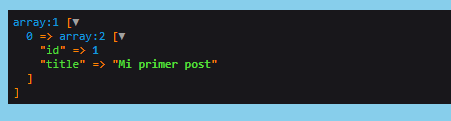

# Consultas a BD

En Symfony disponemos de dos maneras de realizar consultas a base de datos.

* Métodos mágicos

  Son una serie de métodos proporcionados por Doctrine que nos facilitan las consultas. La parte negativa es que puede traer más datos de los necesario, lo que para proyectos grandes puede ser un problema para el rendimiento.


* Repository

  Es más complejo pero flexible. Nos permite realizar consultas personalizadas y mejor optimizadas.


## CRUD

A continuación podemos ver una serie de ejemplos de como se realiza la operación de Create, Read, Update y Delete en Symfony de un objeto. Este código se tendría que ubicar en el controlador correspondiente.


Read

Este ejemplo también serviría para renderizar la vista del Frontend. Consultar documentación sobre los métodos mágicos y Repository para más información.


```javascript
    #[Route('/post/{id}', name: 'app_post')]
    public function index($id): Response
    {
        // Usando un método mágico
        $post = $this->em->getRepository(Post::class)->find($id);
        // Usando un método personalizado de Repository
        $custom_post = $this->em->getRepository(Post::class)->findPost($id);

        return $this->render('post/index.html.twig', [
            'post' => $post,
            'custom_post' => $custom_post
        ]);
    }
```


Create

```javascript
    #[Route('/insert/post', name: 'insert_post')]
    public function insert(){
        $post = new Post('Mi post Insertado', 'Opinion', 'Hola mundo', 'holita.jpg', 'hola mundo');

        $user = $this->em->getRepository(User::class)->find(1);
        $post->setUser($user);

        $this->em->persist($post);
        $this->em->flush();

        return new JsonResponse(['success' => true]);
    }
```


Update

```javascript
    #[Route('/update/post', name: 'insert_post')]
    public function update(){
        $post = $this->em->getRepository(Post::class)->find(4);
        $post->setTitle('Mi nuevo titulo');
        $this->em->flush();

        return new JsonResponse(['success' => true]);
    }
```


Delete

```javascript
    #[Route('/remove/post', name: 'insert_post')]
    public function remove(){
        $post = $this->em->getRepository(Post::class)->find(4);
        $this->em->remove($post);
        $this->em->flush();

        return new JsonResponse(['success' => true]);
    }
```

## Métodos mágicos

Desde el controlador, podemos consultar los objetos (En Symfony configurados como Entity) que están almacenados en BD sin la necesidad de tener que configurar la consulta. Esto nos brinda una gran facilidad.Sin embargo, es necesario aclarar que los métodos mágicos tienen la desventaja de que nos devuelve todos los campos y sus relaciones, sin posibilidad de especificar columnas, lo cual en aplicaciones grandes puede ser un lastre para el rendimiento. 

A continuación podemos ver un ejemplo.

```php
class PostController extends AbstractController
{
    #[Route('/post/{id}', name: 'app_post')]
    public function index(Post $post): Response
    {
        return $this->render('post/index.html.twig', [
            'post' => $post,
        ]);
    }
}
```


Existe una forma alternativa que consiste en utilizar EntityManager. A continuación podemos ver un ejemplo que cumple el mismo objetivo que el anterior pero codificado de esta manera diferente.

```php
class PostController extends AbstractController
{
    private $em;

    /**
     * @param $em
     */
    public function __construct(EntityManagerInterface $em)
    {
        $this->em = $em;
    }

    #[Route('/post/{id}', name: 'app_post')]
    public function index($id): Response
    {
        $post = $this->em->getRepository(Post::class)->find($id);

        return $this->render('post/index.html.twig', [
            'post' => $post,
        ]);
    }
}
```


Importante recordar importar bien las librerías en caso de que el IDE no lo haga. Un ejemplo puede ser la siguiente que puede dar problemas si no está:`use Doctrine\ORM\EntityManagerInterface;`


Igualmente podemos realizar consultas un poco más especificas empleando los métodos mágicos

`find()`          → Encuentra un objeto por un valor clave

`findAll()`     → Devuelve todas los objetos de la tabla sin filtrar

`findBy()`      → Nos permite realizar un mejor filtrado, indicando el orden y los limites de objetos a devolver

`findOneBy()` → A diferencia de findBy() este solo devuelve un objeto sin este dentro de un array

Pero sin posibilidad de filtrar por columnas o evitar que se traiga las relaciones.


## Repository

Los Métodos Mágicos de Symfony nos brindan una gran facilidad a la hora de realizar consultas a la base de datos. Sin embargo, como ya hemos podido ver tienen la desventaja de que los datos no se pueden filtrar por columnas o evitar que se traigan las relaciones. Por ello, disponemos de está alternativa.Los Repository hacen uso de DQL (Doctrine Query Language) con el cual podemos realizar consultas personalizadas. De este modo, podemos crear lo que se podría llamar nuestro propio método mágico. 

Estos métodos se deben ubicar dentro del Repository correspondiente al objeto con el que estamos trabajando. Por ejemplo, el siguiente caso corresponde a PostRepository.php

```php
class PostRepository extends ServiceEntityRepository
{
    public function __construct(ManagerRegistry $registry)
    {
        parent::__construct($registry, Post::class);
    }

    // Nuestro método personalizado
    public function findPost($id){
        return $this->getEntityManager()
            ->createQuery('
                SELECT post.id, post.title
                FROM App\Entity\Post post
                WHERE post.id =:id
            ')
            ->setParameter('id', $id)
            ->getResult();
    }
    
    ...
    ...
```

Gracias a esto podemos realizar consultas más personalizadas y optimizadas. Pudiendo traer las columnas que creamos convenientes evitando las que no vamos a usar.

 
