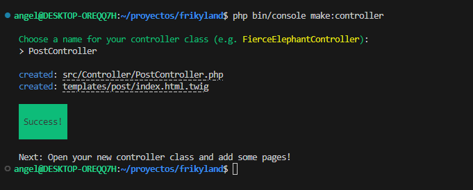
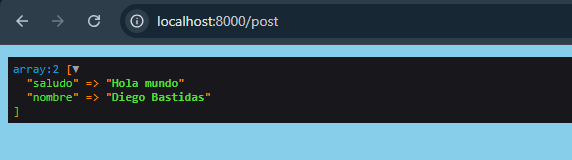

# Controller

## Crear un controlador

```none
php bin/console make:controller
```

A continuación nos pedirá que ingresemos un nombre cumplido la nomenclatura que se nos indica (ej: PostController)

Con esto se nos habrá creado un Controller y un Template (la vista asociada)


 


## **¿Cómo está formado el controlador (Controller)?**

```php
<?php

namespace App\Controller;

use Symfony\Bundle\FrameworkBundle\Controller\AbstractController;
use Symfony\Component\HttpFoundation\Response;
use Symfony\Component\Routing\Attribute\Route;

class PostController extends AbstractController
{
    #[Route('/post', name: 'app_post')]
    public function index(): Response
    {
        return $this->render('post/index.html.twig', [
            'controller_name' => 'PostController',
        ]);
    }
}
```


Esta línea le indica a Symfony la ruta que hay que pone en el navegador para que se ejecute el bloque del código

```javascript
#[Route('/post', name: 'app_post')]
```

Dentro de ese bloque de código nos podemos encontrar el retorno del siguiente método

```javascript
        return $this->render('post/index.html.twig', [
            'controller_name' => 'PostController',
        ]);
```

El cual retorna un Template localizado en la ruta indicada `post/index.html.twig` teniendo la posibilidad de pasarle parámetros.


## ¿Cómo está formada la vista (Template)?

```php


Hello PostController!


{{ dump(controller_name) }}

```

Hace uso del motor de renderizado de plantillas Twig que es propio de Symfony. Podemos capturar los parámetros pasados desde controlador directamente. 

Si queremos conocer el tipo de variable podemos hacer uso de la función `dump()` la cual mostrara la información en la vista.  



