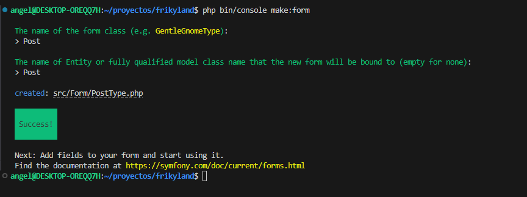
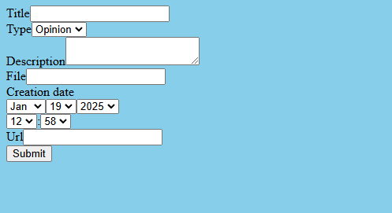

# Formularios

Comando para crear un nuevo formulario

```none
php bin/console make:form
```

Nos hará dos preguntas:


1. Nombre del formulario

   Symfony le agrega automáticamente la palabra Type

2. Entity con la que debe estar relacionado

 


Ejemplo del código de un formulario

En el archivo generado por el comando anterior, podremos especificar los campos que tendrá nuestro formulario. Por defecto se agregan todos los de la Entity pero podemos personalizarlo.

Destacar el campo submit que corresponde al botón que permite enviar el formulario.

```javascript
...
use Symfony\Component\Form\Extension\Core\Type\SubmitType;
use Symfony\Component\Form\Extension\Core\Type\ChoiceType;

class PostType extends AbstractType
{
    public function buildForm(FormBuilderInterface $builder, array $options): void
    {
        $builder
            ->add('title')
            ->add('type', ChoiceType::class, [
                'choices' => Post::TYPES
            ])
            ->add('description')
            ->add('file')
            ->add('creation_date')
            ->add('url')
            ->add('submit', SubmitType::class)
        ;
    }

    public function configureOptions(OptionsResolver $resolver): void
    {
        $resolver->setDefaults([
            'data_class' => Post::class,
        ]);
    }
}
```

Documentación oficial de Symfony donde podemos consultar todos los tipos de datos:<https://symfony.com/doc/current/reference/forms/types.html>


Por otra parte, tendríamos que configurar el formulario en el controlador. Importante el parámetro Request

```javascript
    #[Route('/', name: 'app_post')]
    public function index(Request $request): Response
    {
        $post = new Post();
        $form = $this->createForm(PostType::class, $post);
        $form->handleRequest($request);
        
        // En caso de que se envie el formulario y sea valido
        if ($form->isSubmitted() && $form->isValid()) { 
            $user = $this->em->getRepository(User::class)->find(1);
            $post->setUser($user);

            $this->em->persist($post);
            $this->em->flush();
            return $this->redirectToRoute('app_post');
        }       
        
        //Renderizamos el formulario en la vista
        return $this->render('post/index.html.twig', [
            'form' => $form->createView()
        ]);
    }
```


Cómo se vería en la página web  


