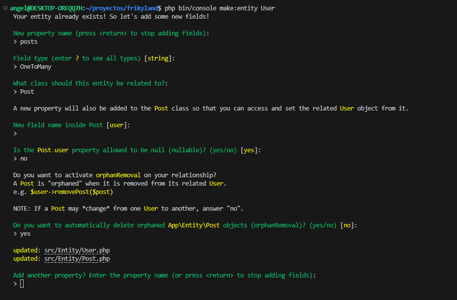
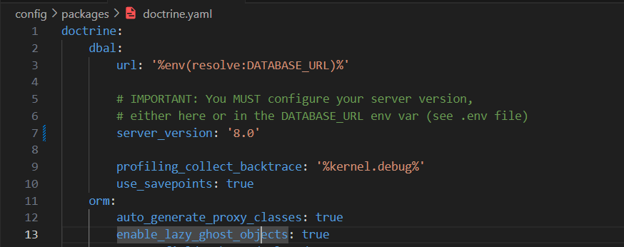
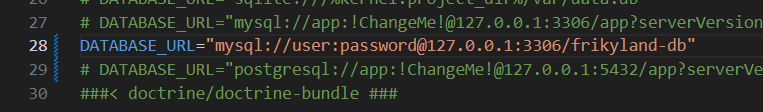

# Creación y gestión de la base de datos

Para la base de datos Symfony utiliza el ORM Doctrine. Disponemos de una serie de comandos que nos facilitan la tarea de crear y gestionar la base de datos.

* Crear base de datos

```none
php bin/console doctrine:database:create
```


* Eliminar base de datos

```none
php bin/console doctrine:database:drop --force
```


Creación del esquema de la BD


* Crear una Entity nueva (Tabla)

```none
php bin/console make:entity <NOMBRE>
```


* Creación de una tabla especifica para usuarios

Se crea la tabla con una serie de campos predefinidos y se realiza una serie de preguntas sobre la gestión de usuarios

```none
php bin/console make:user
```


* Modificar una Entity existente par agregar nuevos campos

```none
php bin/console make:entity
```

A continuación cuando se nos pregunte introducimos el nombre de la entity a modificar


* Crear una relación entre tablas

```none
php bin/console make:entity <NOMBRE ENTITY EXISTENTE>
```

Cuando se nos pregunte el tipo de campos debemos introducir un tipo de relación (Por ejemplo: OneToMany). Tras esto, habrá una serie de preguntas sobre como queremos que sea dicha relación.


 


Generación del schema para que se aplique en la base de datos

```none
php bin/console doctrine:schema:update --force
```

Importante tener configurado de manera correcta la conexión a la BD en el archivo `.env` y la configuración de doctrine en `config > packages > doctrine.yaml` donde se debe indicar la versión de mysql en el campo server_version ya que es un punto donde puede dar problemas


Archivo `doctrine.yaml`

 


Archivo `.env`

 
