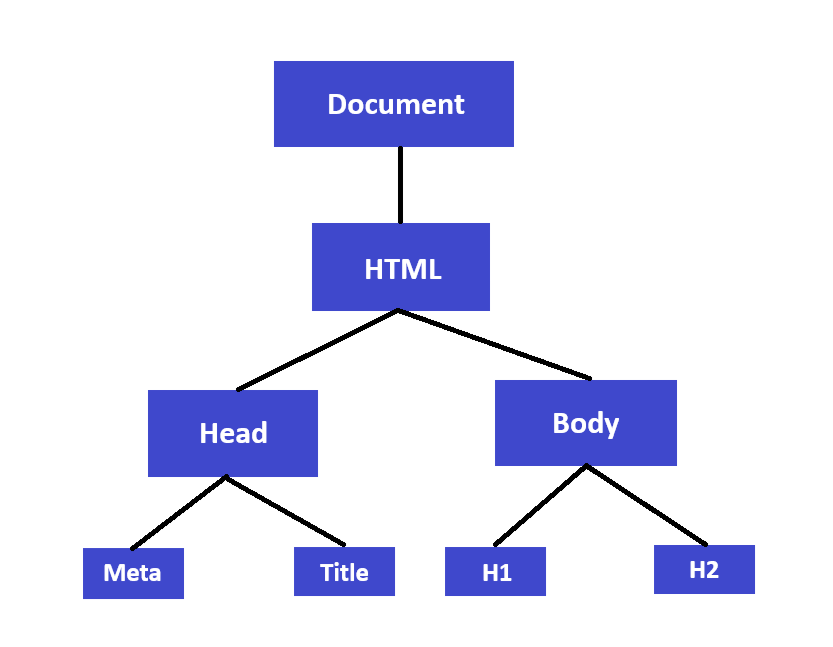

# PHP

Se trata de un lenguaje de programación interpretado de código abierto para el desarrollo web que se ejecuta en el servidor donde cada usuario tiene un contexto de ejecución diferente.

El codigo PHP se localiza dentro de archivos con la extensión `.php` donde el código se combina con el html, css y javascript. El código PHP se debe ubicar dentro del siguiente bloque

``` php
<?php
// Aquí iria el código de PHP
?>
```

Puede haber varios bloques de PHP en una misma página. Si todo el archivo es PHP podemos prescindir del `?>`

## Configuración

Podemos configurar diversas caracteristicas del lenguaje a través del archivo de configuración `php.ini`

En el podemos por ejemplo indicar si queremos permitir que se visualicen los errores en las páginas. Está opción por defecto viene desactiviada por seguridad. La visualización de errores proporcionan información que se puede utilizar con fines no deseados.

`display_errors = On`

En PHP 7 si tenías los errores ocultos salía una página en blanco. En PHP 8 sale un error 500.

Es posible también habilitar o deshabilitar los errores en tiempo de ejecución, agregado las siguientes lineas en el código. Esto puede ser util para servidores comportidos donde conviven entornos de producción y desarrollo. Aunque no se recomienda por razones de seguridad.

``` php
ini_set('display_errors', 1);
ini_set('display_startup_errors', 1);
error_reporting(E_ALL);
```

### Tipos de errores
Existen tres tipos de errores:  
- fatal error -> Error grave que detiene completamente el script  
- warning -> Un error menos grave que no detiene la ejecución  
- notice -> Una sugerencia o nota sobre algo que podría ser un problema

## ¿Qué es el DOM?

El DOM (Document Object Model) es una interfaz de programación que representa un documento HTML o XML como un árbol de nodos. Esta estructura en memoria permite que lenguajes de scripting como JavaScript interactúen con los elementos de la página web, manipulando dinámicamente su contenido, estructura y estilo. El DOM funciona como un puente entre la página web y el código, haciendo posible crear páginas web interactivas y dinámicas.

<p style="text-align: center;">
  
</p>

## Comentario

Podemos crear comentarios en el código de las siguientes tres formas.

``` php
// Comentario
# Comentario
/* Comentario */
```

## Variables y constante

Se crean agregando delante del nombre el simbolo `$` y no necesitan que declares el tipo.

``` php
$numero = "12";
$numero2 = false;

echo $numero + $numero2;  // Mostraría 12
```

Es posible declarar una constante del siguiente modo

``` php
define("EXAMPLE", "something")
```

## Condicionales

Condicional `if`

``` php
if ($a > $b) {
  echo "a es más grande que b";
  $b = $a;
}
```

Condicional `switch`

``` php
switch ($i) {
    case 0:
        echo "i igual 0";
        break;
    case 1:
        echo "i igual 1";
        break;
    case 2:
        echo "i igual 2";
        break;
}
```
